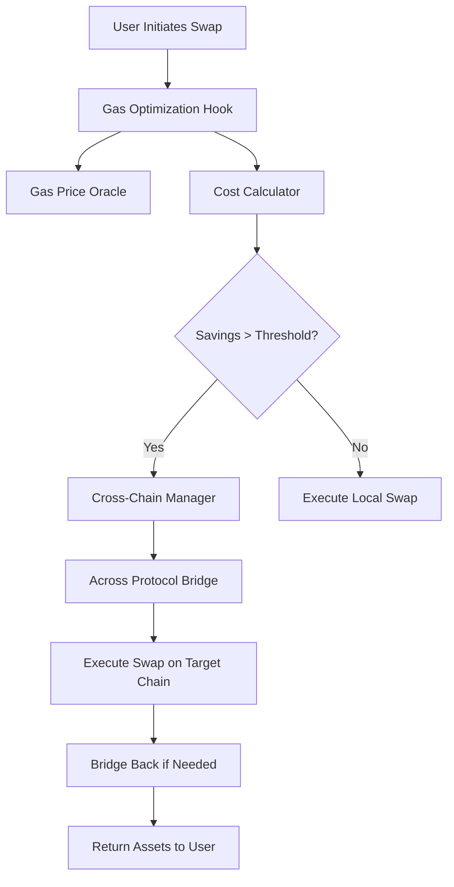

# 🌉 Crosschain Gas Price Optimization Hook

A sophisticated Uniswap V4 hook that automatically routes swaps to the most cost-effective blockchain using Across Protocol, maximizing user savings through intelligent gas price optimization and cross-chain execution.

## 🎯 Problem Statement

DeFi users lose significant value to gas fees when swapping on expensive chains. A typical 1 ETH swap on Ethereum mainnet can cost $50+ in gas fees, while the identical swap on Arbitrum costs ~$2. Our hook eliminates this inefficiency by automatically detecting optimal execution chains and seamlessly bridging assets for maximum cost savings.

## 🏗️ Architecture Overview



## 📁 Project Structure

```
crosschain-gas-optimization-hook/
├── src/
│   ├── hooks/
│   │   ├── GasOptimizationHook.sol           # Main hook implementation
│   │   └── base/
│   │       └── OptimizedBaseHook.sol         # Enhanced base hook with gas optimizations
│   ├── core/
│   │   ├── CrossChainManager.sol             # Cross-chain execution coordinator
│   │   ├── GasPriceOracle.sol               # Multi-chain gas price aggregator
│   │   ├── CostCalculator.sol               # Total cost analysis engine
│   │   └── HookConfiguration.sol            # Configuration and governance
│   ├── integrations/
│   │   ├── AcrossIntegration.sol            # Across Protocol interface
│   │   ├── ChainlinkIntegration.sol         # Chainlink price feed integration
│   │   └── UniswapV4Integration.sol         # Enhanced V4 pool interactions
│   ├── libraries/
│   │   ├── ChainUtils.sol                   # Chain-specific utilities
│   │   ├── GasCalculations.sol              # Gas estimation algorithms
│   │   ├── SafeBridging.sol                 # Bridge safety mechanisms
│   │   └── TokenMapping.sol                 # Cross-chain token address mapping
│   ├── interfaces/
│   │   ├── IGasOptimizationHook.sol         # Main hook interface
│   │   ├── ICrossChainManager.sol           # Cross-chain manager interface
│   │   ├── IGasPriceOracle.sol              # Gas oracle interface
│   │   ├── ICostCalculator.sol              # Cost calculator interface
│   │   └── external/
│   │       ├── IAcrossProtocol.sol          # Across Protocol interfaces
│   │       └── IChainlinkAggregator.sol     # Chainlink aggregator interfaces
│   ├── storage/
│   │   ├── GasOptimizationStorage.sol       # Hook storage layout
│   │   └── CrossChainStorage.sol            # Cross-chain state management
│   └── utils/
│       ├── Errors.sol                       # Custom error definitions
│       ├── Events.sol                       # Event definitions
│       └── Constants.sol                    # System constants
├── test/
│   ├── unit/
│   │   ├── GasOptimizationHook.t.sol        # Hook unit tests
│   │   ├── GasPriceOracle.t.sol             # Oracle unit tests
│   │   ├── CostCalculator.t.sol             # Calculator unit tests
│   │   └── CrossChainManager.t.sol          # Manager unit tests
│   ├── integration/
│   │   ├── CrossChainFlow.t.sol             # End-to-end integration tests
│   │   ├── AcrossIntegration.t.sol          # Across Protocol integration tests
│   │   └── MultiChainScenarios.t.sol        # Multi-chain test scenarios
│   ├── fork/
│   │   ├── MainnetFork.t.sol                # Mainnet fork tests
│   │   ├── ArbitrumFork.t.sol               # Arbitrum fork tests
│   │   └── CrossChainFork.t.sol             # Cross-chain fork tests
│   ├── mocks/
│   │   ├── MockSpokePool.sol                # Mock Across spoke pool
│   │   ├── MockChainlinkOracle.sol          # Mock Chainlink price feed
│   │   └── MockPoolManager.sol              # Mock Uniswap pool manager
│   └── utils/
│       ├── TestConstants.sol                # Test configuration constants
│       ├── TestHelpers.sol                  # Common test utilities
│       └── ForkHelpers.sol                  # Fork testing utilities
├── script/
│   ├── deployment/
│   │   ├── Deploy.s.sol                     # Main deployment script
│   │   ├── DeployHook.s.sol                 # Hook-specific deployment
│   │   ├── ConfigureChains.s.sol            # Multi-chain configuration
│   │   └── VerifyContracts.s.sol            # Contract verification
│   ├── management/
│   │   ├── UpdateGasPrices.s.sol            # Gas price update script
│   │   ├── ConfigureThresholds.s.sol        # Threshold configuration
│   │   └── EmergencyPause.s.sol             # Emergency controls
│   └── utils/
│       ├── NetworkConfig.s.sol              # Network-specific configurations
│       └── DeploymentHelpers.s.sol          # Deployment utilities
├── docs/
│   ├── architecture/
│   │   ├── ARCHITECTURE.md                  # System architecture documentation
│   │   ├── FLOW_DIAGRAMS.md                 # Process flow documentation
│   │   └── SECURITY.md                      # Security considerations
│   ├── integration/
│   │   ├── ACROSS_INTEGRATION.md            # Across Protocol integration guide
│   │   ├── UNISWAP_V4.md                    # Uniswap V4 integration details
│   │   └── CHAINLINK_ORACLES.md             # Oracle integration guide
│   └── api/
│       ├── HOOK_API.md                      # Hook API documentation
│       └── EXTERNAL_APIS.md                 # External API documentation
├── config/
│   ├── chains/
│   │   ├── ethereum.json                    # Ethereum configuration
│   │   ├── arbitrum.json                    # Arbitrum configuration
│   │   ├── optimism.json                    # Optimism configuration
│   │   ├── polygon.json                     # Polygon configuration
│   │   └── base.json                        # Base configuration
│   ├── tokens/
│   │   └── token-mapping.json               # Cross-chain token mappings
│   └── deployment/
│       ├── testnet-config.json              # Testnet deployment configuration
│       └── mainnet-config.json              # Mainnet deployment configuration
├── lib/                                     # Forge dependencies
├── remappings.txt                          # Import path mappings
├── foundry.toml                            # Foundry configuration
├── package.json                            # Node.js dependencies
├── .env.example                            # Environment variables template
├── .gitignore
├── LICENSE
└── README.md
```

## 🔧 Core Contracts

### 🎯 Main Hook Implementation

#### `GasOptimizationHook.sol`
The primary hook contract that integrates with Uniswap V4's pool manager to intercept swaps and apply gas optimization logic.

**Key Features:**
- Implements `beforeSwap` hook to analyze and potentially redirect transactions
- Manages user preferences and optimization thresholds
- Coordinates with other system components for decision making
- Handles fallback mechanisms for failed cross-chain operations

**Core Functions:**
```solidity
function beforeSwap(address sender, PoolKey calldata key, IPoolManager.SwapParams calldata params, bytes calldata hookData) external override returns (bytes4);
function getOptimizationQuote(IPoolManager.SwapParams calldata params) external view returns (OptimizationQuote memory);
function setUserPreferences(UserPreferences calldata preferences) external;
```

#### `OptimizedBaseHook.sol`
Enhanced base hook implementation with gas optimizations and additional utility functions.

**Key Features:**
- Gas-optimized hook permission management
- Enhanced error handling and revert reasons
- Transient storage utilization for temporary state
- Batch operation support

---

### 🌐 Cross-Chain Core Components

#### `CrossChainManager.sol`
Central coordinator for all cross-chain operations, managing the lifecycle of cross-chain swaps from initiation to completion.

**Key Features:**
- Cross-chain swap lifecycle management
- Bridge operation coordination with Across Protocol
- State synchronization across chains
- Recovery mechanisms for failed operations

**Core Functions:**
```solidity
function initiateCrossChainSwap(CrossChainSwapParams calldata params) external returns (bytes32 swapId);
function handleDestinationSwap(bytes32 swapId, bytes calldata swapData) external;
function emergencyRecovery(bytes32 swapId) external;
```

#### `GasPriceOracle.sol`
Multi-chain gas price aggregation system that provides real-time gas price data across supported networks.

**Key Features:**
- Simple on-chain gas price tracking with keeper updates
- Chainlink integration for USD value calculations
- Fallback price mechanisms
- Historical gas price tracking for trend analysis

**Core Functions:**
```solidity
function getGasPrice(uint256 chainId) external view returns (uint256 gasPrice, uint256 timestamp);
function updateGasPrices(uint256[] calldata chainIds, uint256[] calldata gasPrices) external onlyKeeper;
function getGasPriceTrend(uint256 chainId, uint256 timeWindow) external view returns (GasTrend memory);
```

#### `CostCalculator.sol`
Sophisticated cost analysis engine that determines the total cost of executing swaps on different chains.

**Key Features:**
- Total cost calculation (gas + bridge fees + slippage)
- USD value calculations using Chainlink price feeds
- Dynamic threshold adjustment based on market conditions
- MEV cost consideration

**Core Functions:**
```solidity
function calculateTotalCost(CostParams calldata params) external view returns (TotalCost memory);
function findOptimalChain(OptimizationParams calldata params) external view returns (uint256 chainId, uint256 expectedSavingsUSD);
function updateCostParameters(CostParameters calldata newParams) external onlyOwner;
```

---

### 🔗 Integration Layer

#### `AcrossIntegration.sol`
Comprehensive integration with Across Protocol for seamless cross-chain asset bridging.

**Key Features:**
- Spoke pool interaction management
- Bridge fee calculation and optimization
- Relayer selection and management
- Bridge transaction monitoring and status tracking

**Core Functions:**
```solidity
function bridgeTokens(BridgeParams calldata params) external returns (bytes32 bridgeId);
function getBridgeFee(address token, uint256 amount, uint256 destinationChain) external view returns (uint256 fee);
function getBridgeStatus(bytes32 bridgeId) external view returns (BridgeStatus memory);
```

#### `ChainlinkIntegration.sol`
Integration with Chainlink's decentralized oracle network for reliable USD price feeds.

**Key Features:**
- ETH/USD, USDC/USD, and other token price feeds
- Multi-chain price feed support
- Price feed health monitoring
- Fallback price mechanisms for USD value calculations

**Core Functions:**
```solidity
function getTokenPriceUSD(address token) external view returns (uint256 priceUSD);
function calculateSavingsUSD(uint256 gasSavingsWei) external view returns (uint256 savingsUSD);
function validatePriceFeed(address feed) external view returns (bool isValid);
```

#### `UniswapV4Integration.sol`
Enhanced integration utilities for Uniswap V4 pool interactions.

**Key Features:**
- Pool state analysis
- Liquidity depth assessment
- Slippage calculation
- Pool fee optimization

---

### 📚 Library Contracts

#### `GasCalculations.sol`
Advanced gas estimation and calculation algorithms using simple Solidity math.

**Key Features:**
- EIP-1559 gas price prediction
- Transaction cost modeling using basis points
- Gas usage optimization
- Network congestion impact analysis

**Example Implementation:**
```solidity
function calculateSavingsPercent(uint256 originalCost, uint256 optimizedCost) 
    external pure returns (uint256) {
    if (optimizedCost >= originalCost) return 0;
    return ((originalCost - optimizedCost) * 10000) / originalCost; // basis points
}
```

#### `ChainUtils.sol`
Chain-specific utilities and helper functions.

**Key Features:**
- Chain ID validation and mapping
- Block time and finality calculations
- Network-specific parameter management
- Chain health monitoring

#### `SafeBridging.sol`
Security-focused bridging utilities and safety mechanisms.

**Key Features:**
- Bridge transaction validation
- Anti-MEV protection mechanisms
- Bridge limit enforcement
- Emergency circuit breakers

#### `TokenMapping.sol`
Cross-chain token address mapping and validation.

**Key Features:**
- Token address resolution across chains
- Token metadata validation
- Supported token registry
- Token bridge compatibility checks

---

### 🎛️ Configuration & Storage

#### `HookConfiguration.sol`
Centralized configuration management with governance controls.

**Key Features:**
- Parameter management with timelock
- Multi-signature governance integration
- Emergency parameter updates
- Configuration validation

**Configuration Parameters:**
```solidity
struct HookConfig {
    uint256 minSavingsThresholdBPS;     // Minimum savings threshold (basis points)
    uint256 minAbsoluteSavingsUSD;      // Minimum absolute savings in USD
    uint256 maxBridgeTimeSeconds;       // Maximum acceptable bridge time
    uint256 gasPriceUpdateInterval;     // Gas price update frequency
    uint256 emergencyPauseFlag;         // Emergency pause mechanism
    mapping(uint256 => ChainConfig) chainConfigs;  // Per-chain configurations
}
```

#### `GasOptimizationStorage.sol` & `CrossChainStorage.sol`
Optimized storage layouts using storage slots and packed structs for gas efficiency.

**Key Features:**
- Packed storage structures
- Storage slot optimization
- State transition tracking
- Historical data retention

---

## 🎯 Key Features & Benefits

### ⚡ **Intelligent Gas Optimization**
- **Real-time Analysis**: Continuous monitoring of gas prices across 5+ major chains
- **USD Value Display**: Show users exact dollar savings using Chainlink price feeds
- **Threshold Management**: Configurable savings thresholds (percentage + absolute USD amounts)

### 🌉 **Seamless Cross-Chain Execution**
- **Across Protocol Integration**: Leverage Across's fast, secure bridging infrastructure
- **Automatic Asset Management**: Handle token bridging and return flows transparently
- **Fallback Mechanisms**: Robust error handling and recovery procedures

### 🛡️ **Security & Safety**
- **Multi-signature Governance**: Decentralized parameter management
- **Emergency Controls**: Circuit breakers and pause mechanisms
- **Bridge Security**: Integration with battle-tested Across Protocol
- **MEV Protection**: Built-in protection against sandwich attacks

### 📊 **Advanced Analytics**
- **USD Cost Tracking**: Comprehensive cost analysis with Chainlink USD pricing
- **Savings Reporting**: Real-time and historical savings tracking in USD
- **Performance Metrics**: Bridge success rates, execution times, and user satisfaction

### 🎨 **User Experience**
- **Transparent Operations**: Clear cost breakdowns and USD savings projections
- **Flexible Configuration**: User-customizable optimization preferences
- **Mobile-Friendly**: Optimized for mobile wallet integration

---

## 🚀 Quick Start

### Installation

```bash
# Clone the repository
git clone https://github.com/your-org/crosschain-gas-optimization-hook
cd crosschain-gas-optimization-hook

# Install dependencies
forge install

# Install development dependencies (if using frontend)
npm install

# Copy environment configuration
cp .env.example .env
# Edit .env with your configuration
```

### Dependencies Installation

```bash
# Essential dependencies
forge install Uniswap/v4-periphery --no-commit
forge install across-protocol/contracts --no-commit
forge install OpenZeppelin/openzeppelin-contracts --no-commit
forge install smartcontractkit/chainlink-brownie-contracts --no-commit

# Development & Testing
forge install foundry-rs/forge-std --no-commit

# Optional: Gas-optimized utilities
forge install transmissions11/solmate --no-commit
```

### Build & Test

```bash
# Build all contracts
forge build

# Run unit tests
forge test

# Run integration tests with mainnet fork
forge test --fork-url $ETHEREUM_RPC_URL --match-path "test/integration/*"

# Generate gas report
forge test --gas-report

# Coverage analysis
forge coverage
```

### Deployment

```bash
# Deploy to testnet
forge script script/deployment/Deploy.s.sol --rpc-url $SEPOLIA_RPC_URL --broadcast --verify

# Deploy to mainnet (with additional confirmations)
forge script script/deployment/Deploy.s.sol --rpc-url $ETHEREUM_RPC_URL --broadcast --verify --confirmations 3
```

---

## 📊 Demo Scenarios

### Scenario 1: High-Value ETH Swap
```
💰 User Action: Swap 10 ETH → USDC
📊 Analysis:
  • Ethereum: 180 gwei ($450 gas cost)
  • Arbitrum: 0.1 gwei ($2 gas cost)  
  • Bridge Cost: $8 via Across
🎯 Result: Net Savings: $440 (97.7% reduction)
⚡ Execution: Auto-route to Arbitrum
💸 Display: "You saved $440.00! (0.22 ETH at $2,000/ETH)"
```

### Scenario 2: Multi-Chain Arbitrage
```
💰 User Action: Swap 1000 USDC → ETH
📊 Optimal Route: Polygon (lowest gas) → Bridge back to Ethereum
🎯 Total Savings: $125 including bridge fees
⚡ Execution Time: 3 minutes via Across fast bridge
💸 Display: "You saved $125.00 compared to Ethereum execution"
```

### Scenario 3: Threshold-Based Decision
```
💰 User Action: Swap $50 worth of LINK
📊 Analysis: 15% savings available but only $7.50 absolute
🎯 Decision: Execute locally (below $10 USD threshold)
💸 Display: "Local execution selected - savings below threshold"
```

---

## 🔧 Configuration

### Environment Variables

```bash
# Network RPC URLs
ETHEREUM_RPC_URL=https://eth-mainnet.g.alchemy.com/v2/YOUR_KEY
ARBITRUM_RPC_URL=https://arb-mainnet.g.alchemy.com/v2/YOUR_KEY
OPTIMISM_RPC_URL=https://opt-mainnet.g.alchemy.com/v2/YOUR_KEY
POLYGON_RPC_URL=https://polygon-mainnet.g.alchemy.com/v2/YOUR_KEY
BASE_RPC_URL=https://base-mainnet.g.alchemy.com/v2/YOUR_KEY

# API Keys
ETHERSCAN_API_KEY=your_etherscan_key
ARBISCAN_API_KEY=your_arbiscan_key
POLYGONSCAN_API_KEY=your_polygonscan_key

# Deployment
PRIVATE_KEY=your_private_key
DEPLOYER_ADDRESS=your_deployer_address

# Chainlink Price Feeds
CHAINLINK_ETH_USD_FEED=0x5f4eC3Df9cbd43714FE2740f5E3616155c5b8419
CHAINLINK_USDC_USD_FEED=0x8fFfFfd4AfB6115b954Bd326cbe7B4BA576818f6
GAS_PRICE_UPDATE_INTERVAL=300  # 5 minutes
```

### Hook Configuration

```solidity
struct SystemConfig {
    uint256 minSavingsThresholdBPS;      // 500 (5%)
    uint256 minAbsoluteSavingsUSD;       // $10 USD
    uint256 maxBridgeTimeSeconds;        // 1800 (30 minutes)
    uint256 emergencyPauseDelay;         // 86400 (24 hours)
    bool enableCrossChainArbitrage;      // true
    bool enableUSDDisplayMode;           // true (show USD savings)
}
```

### Chainlink Price Feed Addresses

```solidity
// Ethereum Mainnet
mapping(address => address) public priceFeeds;

constructor() {
    // ETH/USD
    priceFeeds[0xC02aaA39b223FE8D0A0e5C4F27eAD9083C756Cc2] = 0x5f4eC3Df9cbd43714FE2740f5E3616155c5b8419;
    // USDC/USD  
    priceFeeds[0xA0b86a33E6c4b4c2CC6C1C4CdBbD0D8C7b4e5d2A] = 0x8fFfFfd4AfB6115b954Bd326cbe7B4BA576818f6;
    // LINK/USD
    priceFeeds[0x514910771AF9Ca656af840dff83E8264EcF986CA] = 0x2c1d072e956AFFC0D435Cb7AC38EF18d24d9127c;
}
```

---

## 🧪 Testing Strategy

### Unit Tests
- **Contract Logic**: Individual contract functionality
- **Library Functions**: Mathematical calculations using basis points
- **Integration Points**: Interface compatibility testing

### Integration Tests  
- **Cross-Chain Flows**: End-to-end cross-chain swap execution
- **Chainlink Integration**: Price feed reliability and USD calculations
- **Error Handling**: Failure scenarios and recovery mechanisms

### Fork Tests
- **Mainnet Simulation**: Real-world conditions with actual liquidity
- **Multi-Chain Scenarios**: Cross-chain interactions with live protocols
- **Gas Optimization**: Actual gas usage analysis and optimization

### Performance Tests
- **Gas Efficiency**: Optimize contract gas usage
- **Throughput**: Handle multiple concurrent operations
- **Latency**: Minimize execution delays

---

## 📈 Metrics & Monitoring

### Success Metrics
- **Total USD Saved**: Cumulative dollar savings across all users
- **User Adoption**: Percentage of eligible swaps using optimization
- **Bridge Success Rate**: Successful cross-chain executions
- **Average Savings**: Mean percentage and absolute USD savings per swap

### Monitoring Dashboards
- **Real-time Gas Prices**: Live monitoring across all supported chains
- **USD Conversion Rates**: Chainlink price feed status and health
- **Bridge Status**: Across Protocol bridge health and performance
- **User Activity**: Swap volume and optimization usage patterns
- **System Health**: Contract status, oracle feeds, and error rates

---

## 🛣️ Roadmap

### Phase 1: Core Implementation ✅
- [x] Basic hook functionality
- [x] Simple gas price oracle with keeper updates
- [x] Across Protocol bridging
- [x] Cost calculation engine with USD display

### Phase 2: Advanced Features 🚧
- [ ] MEV protection mechanisms
- [ ] Batch optimization for multiple users
- [ ] Enhanced gas price prediction
- [ ] Advanced user preference management

### Phase 3: Ecosystem Integration 📋
- [ ] Integration with major wallet providers
- [ ] Mobile application support
- [ ] Additional bridge protocol support
- [ ] Governance token and incentive mechanisms

### Phase 4: Scaling & Optimization 📋
- [ ] Layer 2 expansion (zkSync, Starknet)
- [ ] Advanced arbitrage strategies
- [ ] Institutional-grade features
- [ ] White-label solution for other protocols

---

## 🤝 Contributing

We welcome contributions from the community! Please see our [Contributing Guidelines](CONTRIBUTING.md) for details on:

- Code style and standards
- Testing requirements
- Pull request process
- Issue reporting

### Development Workflow

1. Fork the repository
2. Create a feature branch (`git checkout -b feature/amazing-feature`)
3. Write tests for your changes
4. Ensure all tests pass (`forge test`)
5. Run linting and formatting (`forge fmt`)
6. Commit your changes (`git commit -m 'Add amazing feature'`)
7. Push to the branch (`git push origin feature/amazing-feature`)
8. Open a Pull Request

---

## 📄 License

This project is licensed under the MIT License - see the [LICENSE](LICENSE) file for details.

---

## 🏆 Acknowledgments

- **Uniswap Labs** for the innovative V4 hook architecture
- **Across Protocol** for secure and efficient cross-chain infrastructure  
- **Chainlink** for reliable USD price feeds and oracle services
- **OpenZeppelin** for security-focused smart contract libraries
- **Foundry** for excellent development tooling

---

**Built with ❤️ for the Uniswap Hook Incubator Hackathon** 🦄⚡

*Revolutionizing DeFi through intelligent cross-chain optimization*
