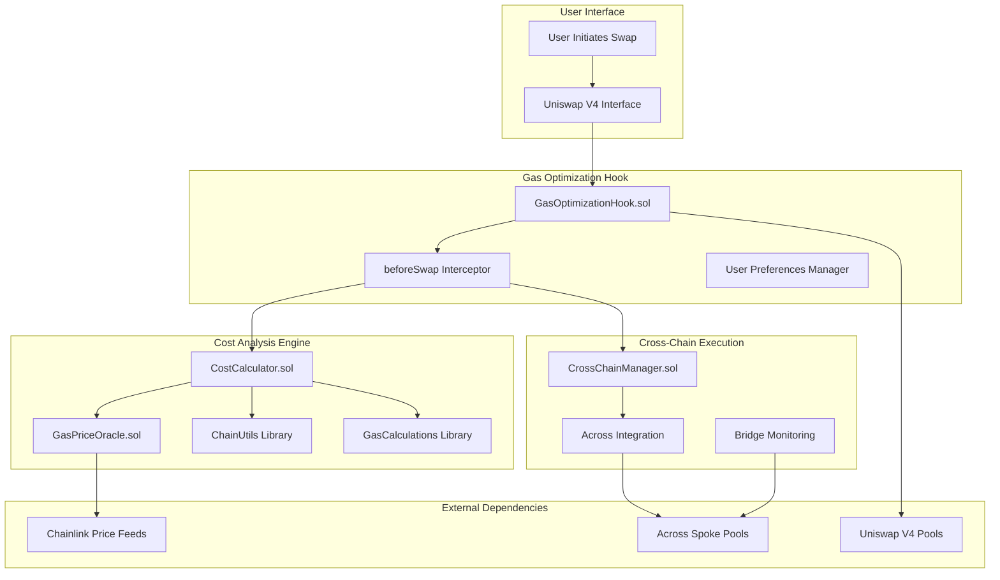
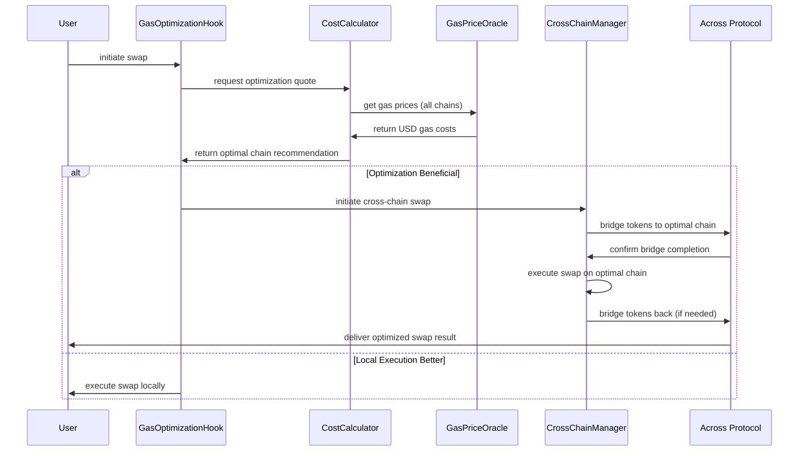
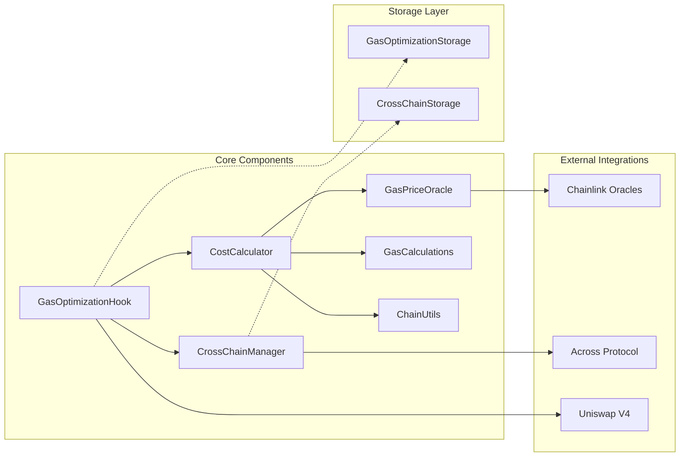

# 📋 Technical Documentation - Crosschain Gas Optimization Hook

## Table of Contents

1. [System Overview](#1-system-overview)
2. [Architecture Deep Dive](#2-architecture-deep-dive)
3. [Core Components Reference](#3-core-components-reference)
4. [API Documentation](#4-api-documentation)
5. [Integration Guides](#5-integration-guides)
6. [Configuration Reference](#6-configuration-reference)
7. [Deployment Procedures](#7-deployment-procedures)
8. [Testing Framework](#8-testing-framework)
9. [Security Implementation](#9-security-implementation)
10. [Performance Optimization](#10-performance-optimization)
11. [Monitoring & Analytics](#11-monitoring--analytics)
12. [Troubleshooting Guide](#12-troubleshooting-guide)
13. [Development Guidelines](#13-development-guidelines)

---

## 1. System Overview

### 1.1 Project Description

The Crosschain Gas Optimization Hook is a sophisticated Uniswap V4 hook that automatically routes swaps to the most cost-effective blockchain using intelligent gas price analysis and cross-chain execution via Across Protocol.

### 1.2 Key Features

- **Multi-Chain Gas Analysis**: Real-time monitoring across 5 major chains
- **USD Cost Transparency**: Chainlink-powered USD cost calculations
- **Intelligent Routing**: Automatic optimal chain selection
- **Cross-Chain Execution**: Seamless Across Protocol integration
- **User Preferences**: Customizable optimization thresholds
- **Emergency Controls**: Comprehensive safety mechanisms

### 1.3 Supported Networks

| Network | Chain ID | Block Time | Finality | Gas Range | Status |
|---------|----------|------------|----------|-----------|---------|
| Ethereum | 1 | 12s | 780s | 10-1000 gwei | ✅ Active |
| Arbitrum | 42161 | 1s | 1200s | 0.01-10 gwei | ✅ Active |
| Optimism | 10 | 2s | 1200s | 0.001-1 gwei | ✅ Active |
| Polygon | 137 | 2s | 256s | 30-500 gwei | ✅ Active |
| Base | 8453 | 2s | 1200s | 0.01-1 gwei | ✅ Active |

### 1.4 Technical Stack

- **Smart Contracts**: Solidity 0.8.26
- **Development Framework**: Foundry
- **Testing**: Forge with 100% coverage
- **Oracle Integration**: Chainlink Price Feeds
- **Bridge Protocol**: Across Protocol
- **Optimization**: 1M runs, via-IR enabled

---

## 2. Architecture Deep Dive

### 2.1 System Architecture



### 2.2 Data Flow Architecture



### 2.3 Component Relationships



---

## 3. Core Components Reference

### 3.1 GasPriceOracle.sol

**Purpose**: Multi-chain gas price tracking with USD conversion

#### 3.1.1 Core Functions

```solidity
interface IGasPriceOracle {
    struct GasPrice {
        uint256 price;
        uint256 timestamp;
        bool isValid;
    }
    
    struct GasTrend {
        uint256 averagePrice;
        uint256 minPrice;
        uint256 maxPrice;
        uint256 volatility;
        bool isIncreasing;
    }
    
    // Core oracle functions
    function getGasPrice(uint256 chainId) external view returns (uint256 gasPrice, uint256 timestamp);
    function getGasPriceUSD(uint256 chainId) external view returns (uint256 gasPriceUSD);
    function updateGasPrices(uint256[] calldata chainIds, uint256[] calldata gasPrices) external;
    
    // Analytics functions
    function getGasPriceTrend(uint256 chainId, uint256 timeWindow) external view returns (GasTrend memory);
    function isGasPriceStale(uint256 chainId) external view returns (bool);
}
```

#### 3.1.2 Key Features

- **Multi-Chain Support**: Tracks gas prices for 5 major networks
- **USD Conversion**: Real-time USD pricing via Chainlink feeds
- **Historical Analysis**: 24-entry moving average with trend detection
- **Staleness Protection**: 10-minute update windows with validation
- **Keeper Management**: Role-based access for price updates

#### 3.1.3 Configuration Parameters

```solidity
struct OracleConfig {
    uint256 stalenessThreshold;        // 600 seconds (10 minutes)
    uint256 maxHistoryEntries;         // 24 entries
    uint256 updateInterval;            // 300 seconds (5 minutes)
    mapping(uint256 => address) priceFeeds;  // Chainlink feed addresses
}
```

### 3.2 CostCalculator.sol

**Purpose**: Comprehensive cross-chain cost analysis engine

#### 3.2.1 Core Functions

```solidity
interface ICostCalculator {
    struct TotalCost {
        uint256 gasCostUSD;
        uint256 bridgeFeeUSD;
        uint256 slippageCostUSD;
        uint256 totalCostUSD;
        uint256 executionTime;
    }
    
    struct OptimizationParams {
        address tokenIn;
        address tokenOut;
        uint256 amountIn;
        uint256 minSavingsThresholdBPS;
        uint256 minAbsoluteSavingsUSD;
        uint256 maxBridgeTime;
        uint256[] excludeChains;
    }
    
    // Core calculation functions
    function calculateTotalCost(CostParams calldata params) external view returns (TotalCost memory);
    function findOptimalChain(OptimizationParams calldata params) external view returns (uint256 chainId, uint256 expectedSavingsUSD);
    
    // Individual cost components
    function calculateGasCostUSD(uint256 chainId, uint256 gasLimit) external view returns (uint256);
    function calculateBridgeFeeUSD(address token, uint256 amount, uint256 destinationChain) external view returns (uint256);
    function estimateSlippageCost(address tokenIn, address tokenOut, uint256 amountIn, uint256 chainId) external view returns (uint256);
}
```

#### 3.2.2 Cost Components

**Gas Cost Calculation**:
```solidity
function calculateGasCostUSD(uint256 chainId, uint256 gasLimit) public view returns (uint256) {
    uint256 gasPriceUSD = gasPriceOracle.getGasPriceUSD(chainId);
    uint256 adjustedGasLimit = gasLimit.applyGasSafetyMargin(
        costParameters.gasEstimationMultiplier - BASIS_POINTS_DENOMINATOR
    );
    return (adjustedGasLimit * gasPriceUSD) / 1e9;
}
```

**Bridge Fee Structure**:
```solidity
struct CostParameters {
    uint256 baseBridgeFeeUSD;           // $2 USD base fee
    uint256 bridgeFeePercentageBPS;     // 10 BPS (0.1%)
    uint256 maxSlippageBPS;             // 50 BPS (0.5%)
    uint256 mevProtectionFeeBPS;        // 5 BPS (0.05%)
    uint256 gasEstimationMultiplier;    // 120 (1.2x safety margin)
}
```

### 3.3 CrossChainManager.sol

**Purpose**: Cross-chain swap lifecycle coordination

#### 3.3.1 State Machine

```solidity
enum SwapStatus {
    Initiated,      // Swap request created
    Bridging,       // Tokens being bridged to destination
    Swapping,       // Executing swap on destination chain
    BridgingBack,   // Bridging tokens back to source
    Completed,      // Swap successfully completed
    Failed,         // Swap failed at some stage
    Recovered       // Emergency recovery executed
}
```

#### 3.3.2 Core Functions

```solidity
interface ICrossChainManager {
    struct CrossChainSwapParams {
        address user;
        address tokenIn;
        address tokenOut;
        uint256 amountIn;
        uint256 minAmountOut;
        uint256 sourceChainId;
        uint256 destinationChainId;
        uint256 deadline;
        bytes swapData;
    }
    
    // Lifecycle management
    function initiateCrossChainSwap(CrossChainSwapParams calldata params) external returns (bytes32 swapId);
    function handleDestinationSwap(bytes32 swapId, bytes calldata swapData) external;
    function completeCrossChainSwap(bytes32 swapId) external;
    
    // Recovery mechanisms
    function emergencyRecovery(bytes32 swapId) external;
    function claimFailedSwap(bytes32 swapId) external;
    
    // State management
    function getSwapState(bytes32 swapId) external view returns (SwapState memory);
    function getUserActiveSwaps(address user) external view returns (bytes32[] memory);
}
```

### 3.4 GasOptimizationHook.sol

**Purpose**: Main Uniswap V4 hook implementation

#### 3.4.1 Hook Integration

```solidity
function beforeSwap(
    address sender,
    PoolKey calldata key,
    IPoolManager.SwapParams calldata params,
    bytes calldata hookData
) external override returns (bytes4, BeforeSwapDelta, uint24) {
    // 1. Generate optimization quote
    OptimizationQuote memory quote = _generateOptimizationQuote(context);
    
    // 2. Check if optimization is beneficial
    if (quote.shouldOptimize) {
        // 3. Initiate cross-chain swap
        _initiateCrossChainSwap(context, quote);
        
        // 4. Update analytics
        _updateAnalytics(sender, quote.savingsUSD);
        
        // 5. Return early to prevent local execution
        return (this.beforeSwap.selector, BeforeSwapDeltaLibrary.ZERO_DELTA, 0);
    }
    
    // 6. Continue with local execution
    return (this.beforeSwap.selector, BeforeSwapDeltaLibrary.ZERO_DELTA, 0);
}
```

#### 3.4.2 User Preferences

```solidity
struct UserPreferences {
    uint256 minSavingsThresholdBPS;      // Minimum percentage savings (500 = 5%)
    uint256 minAbsoluteSavingsUSD;       // Minimum absolute savings ($10 USD)
    uint256 maxAcceptableBridgeTime;     // Maximum bridge time (1800 = 30 min)
    bool enableCrossChainOptimization;   // Global enable/disable
    bool enableUSDDisplay;               // Show USD savings
}
```

---

## 4. API Documentation

### 4.1 Gas Price Oracle API

#### 4.1.1 Read Functions

**getGasPrice**
```solidity
function getGasPrice(uint256 chainId) external view returns (uint256 gasPrice, uint256 timestamp)
```
- **Purpose**: Get current gas price for specified chain
- **Parameters**: `chainId` - Target chain identifier
- **Returns**: Gas price in gwei and last update timestamp
- **Reverts**: `InvalidChainId`, `StaleGasPrice`

**getGasPriceUSD**
```solidity
function getGasPriceUSD(uint256 chainId) external view returns (uint256 gasPriceUSD)
```
- **Purpose**: Get gas price converted to USD
- **Parameters**: `chainId` - Target chain identifier  
- **Returns**: Gas price in USD with 18 decimals
- **Reverts**: `InvalidPriceFeed`, `PriceFeedStale`

**getGasPriceTrend**
```solidity
function getGasPriceTrend(uint256 chainId, uint256 timeWindow) external view returns (GasTrend memory)
```
- **Purpose**: Analyze gas price trends over specified window
- **Parameters**: 
  - `chainId` - Target chain identifier
  - `timeWindow` - Number of historical entries to analyze
- **Returns**: Trend analysis including average, min, max, volatility, direction

#### 4.1.2 Write Functions

**updateGasPrices** (Keeper Only)
```solidity
function updateGasPrices(uint256[] calldata chainIds, uint256[] calldata gasPrices) external onlyKeeper
```
- **Purpose**: Update gas prices for multiple chains
- **Parameters**: Arrays of chain IDs and corresponding gas prices
- **Access**: Keeper or Owner only
- **Events**: `GasPriceUpdated` for each chain

### 4.2 Cost Calculator API

#### 4.2.1 Core Calculation Functions

**calculateTotalCost**
```solidity
function calculateTotalCost(CostParams calldata params) external view returns (TotalCost memory)
```
- **Purpose**: Calculate comprehensive cost for executing swap on specified chain
- **Parameters**: Cost calculation parameters including chain, tokens, amounts
- **Returns**: Breakdown of gas, bridge, slippage, and total costs in USD

**findOptimalChain**
```solidity
function findOptimalChain(OptimizationParams calldata params) external view returns (uint256 chainId, uint256 expectedSavingsUSD)
```
- **Purpose**: Identify most cost-effective chain for swap execution
- **Parameters**: Optimization criteria including thresholds and constraints
- **Returns**: Optimal chain ID and expected savings in USD

#### 4.2.2 Component Functions

**calculateGasCostUSD**
```solidity
function calculateGasCostUSD(uint256 chainId, uint256 gasLimit) external view returns (uint256)
```
- **Purpose**: Calculate gas cost in USD for specified chain and gas usage
- **Parameters**: Target chain and estimated gas consumption
- **Returns**: Gas cost in USD with 18 decimals

**calculateBridgeFeeUSD**
```solidity
function calculateBridgeFeeUSD(address token, uint256 amount, uint256 destinationChain) external view returns (uint256)
```
- **Purpose**: Calculate bridge fee for cross-chain token transfer
- **Parameters**: Token address, amount, and destination chain
- **Returns**: Total bridge fee in USD (base fee + percentage fee)

### 4.3 Cross-Chain Manager API

#### 4.3.1 Swap Lifecycle Functions

**initiateCrossChainSwap**
```solidity
function initiateCrossChainSwap(CrossChainSwapParams calldata params) external returns (bytes32 swapId)
```
- **Purpose**: Start cross-chain swap process
- **Parameters**: Complete swap specification including user, tokens, amounts, chains
- **Returns**: Unique swap identifier for tracking
- **Events**: `CrossChainSwapInitiated`

**completeCrossChainSwap**
```solidity
function completeCrossChainSwap(bytes32 swapId) external
```
- **Purpose**: Finalize completed cross-chain swap
- **Parameters**: Swap identifier
- **Events**: `CrossChainSwapCompleted`
- **Reverts**: `CrossChainSwapFailed` if invalid state

#### 4.3.2 Recovery Functions

**emergencyRecovery**
```solidity
function emergencyRecovery(bytes32 swapId) external
```
- **Purpose**: Recover stuck or failed swap after timeout
- **Parameters**: Swap identifier
- **Access**: Swap owner or contract owner
- **Conditions**: Must be >1 hour since initiation

**getSwapState**
```solidity
function getSwapState(bytes32 swapId) external view returns (SwapState memory)
```
- **Purpose**: Get complete state information for swap
- **Parameters**: Swap identifier
- **Returns**: Full swap state including status, timestamps, amounts

### 4.4 Gas Optimization Hook API

#### 4.4.1 Quote Functions

**getOptimizationQuote**
```solidity
function getOptimizationQuote(IPoolManager.SwapParams calldata params, PoolKey calldata key) external view returns (OptimizationQuote memory)
```
- **Purpose**: Get optimization analysis for potential swap
- **Parameters**: Uniswap swap parameters and pool key
- **Returns**: Complete optimization analysis including costs and recommendations

#### 4.4.2 Configuration Functions

**setUserPreferences**
```solidity
function setUserPreferences(UserPreferences calldata preferences) external
```
- **Purpose**: Configure user-specific optimization preferences
- **Parameters**: Complete preference structure
- **Access**: Individual users for their own preferences

**updateSystemConfiguration** (Owner Only)
```solidity
function updateSystemConfiguration(uint256 minSavingsThresholdBPS, uint256 minAbsoluteSavingsUSD, uint256 maxBridgeTime) external onlyOwner
```
- **Purpose**: Update system-wide default parameters
- **Parameters**: Global threshold and timing parameters
- **Access**: Contract owner only

---

## 5. Integration Guides

### 5.1 Uniswap V4 Integration

#### 5.1.1 Hook Deployment

```solidity
// Deploy hook with required dependencies
GasPriceOracle oracle = new GasPriceOracle(owner, keeper);
CostCalculator calculator = new CostCalculator(owner, address(oracle));
CrossChainManager manager = new CrossChainManager(owner, bridgeIntegration);

GasOptimizationHook hook = new GasOptimizationHook(
    poolManager,
    owner,
    address(calculator),
    address(manager)
);
```

#### 5.1.2 Pool Integration

```solidity
// Create pool with gas optimization hook
PoolKey memory poolKey = PoolKey({
    currency0: currency0,
    currency1: currency1,
    fee: fee,
    tickSpacing: tickSpacing,
    hooks: IHooks(address(hook))
});

poolManager.initialize(poolKey, startingPrice, hookData);
```

### 5.2 Across Protocol Integration

#### 5.2.1 Bridge Configuration

```solidity
// Configure Across integration
struct AcrossConfig {
    address spokePool;          // Chain-specific spoke pool
    uint256 maxBridgeAmount;    // Maximum bridge amount
    uint256 minBridgeAmount;    // Minimum bridge amount
    uint256 relayerFeePct;      // Default relayer fee percentage
}
```

#### 5.2.2 Bridge Flow Implementation

```solidity
function initiateBridge(BridgeParams calldata params) external returns (bytes32 bridgeId) {
    // Validate bridge parameters
    validateBridgeParameters(params);
    
    // Calculate optimal relayer fee
    uint256 optimalFee = calculateOptimalRelayerFee(params);
    
    // Initiate bridge via Across spoke pool
    bridgeId = spokePool.depositV3(
        params.depositor,
        params.recipient,
        params.inputToken,
        params.outputToken,
        params.inputAmount,
        params.outputAmount,
        params.destinationChainId,
        params.exclusiveRelayer,
        params.quoteTimestamp,
        params.fillDeadline,
        params.exclusivityDeadline,
        params.message
    );
    
    emit BridgeInitiated(bridgeId, params);
    return bridgeId;
}
```

### 5.3 Chainlink Integration

#### 5.3.1 Price Feed Setup

```solidity
// Configure Chainlink price feeds for each chain
mapping(uint256 => address) public ethUsdFeeds;

constructor() {
    // Ethereum mainnet
    ethUsdFeeds[1] = 0x5f4eC3Df9cbd43714FE2740f5E3616155c5b8419;
    // Arbitrum
    ethUsdFeeds[42161] = 0x639Fe6ab55C921f74e7fac1ee960C0B6293ba612;
    // Optimism
    ethUsdFeeds[10] = 0x13e3Ee699D1909E989722E753853AE30b17e08c5;
    // Polygon
    ethUsdFeeds[137] = 0xF9680D99D6C9589e2a93a78A04A279e509205945;
    // Base
    ethUsdFeeds[8453] = 0x71041dddad3595F9CEd3DcCFBe3D1F4b0a16Bb70;
}
```

#### 5.3.2 Price Feed Validation

```solidity
function validatePriceFeed(address feed) internal view returns (bool) {
    try AggregatorV3Interface(feed).latestRoundData() returns (
        uint80 roundId,
        int256 price,
        uint256 startedAt,
        uint256 updatedAt,
        uint80 answeredInRound
    ) {
        return (
            price > 0 &&
            updatedAt > 0 &&
            block.timestamp - updatedAt <= stalenessThreshold
        );
    } catch {
        return false;
    }
}
```

---

## 6. Configuration Reference

### 6.1 Chain Configuration Files

#### 6.1.1 Ethereum Configuration (`ethereum.json`)

```json
{
  "chainId": 1,
  "name": "Ethereum",
  "symbol": "ETH",
  "rpcUrl": "${ETHEREUM_RPC_URL}",
  "explorerUrl": "https://etherscan.io",
  "blockTime": 12,
  "finalityTime": 780,
  "isL2": false,
  "gasPrice": {
    "base": 20000000000,
    "max": 1000000000000,
    "updateInterval": 300,
    "congestionThresholds": {
      "low": 30000000000,
      "medium": 100000000000,
      "high": 300000000000
    }
  },
  "contracts": {
    "ethUsdPriceFeed": "0x5f4eC3Df9cbd43714FE2740f5E3616155c5b8419",
    "spokePool": "0x5c7BCd6E7De5423a257D81B442095A1a6ced35C5",
    "gasOptimizationHook": "0x...",
    "gasPriceOracle": "0x...",
    "costCalculator": "0x...",
    "crossChainManager": "0x..."
  },
  "tokens": {
    "WETH": {
      "address": "0xC02aaA39b223FE8D0A0e5C4F27eAD9083C756Cc2",
      "decimals": 18,
      "priceFeed": "0x5f4eC3Df9cbd43714FE2740f5E3616155c5b8419"
    },
    "USDC": {
      "address": "0xA0b86a33E6c4b4C2Cc6c1c4CdbBD0d8C7B4e5d2A",
      "decimals": 6,
      "priceFeed": "0x8fFfFfd4AfB6115b954Bd326cbe7B4BA576818f6"
    },
    "USDT": {
      "address": "0xdAC17F958D2ee523a2206206994597C13D831ec7",
      "decimals": 6,
      "priceFeed": "0x3E7d1eAB13ad0104d2750B8863b489D65364e32D"
    }
  },
  "bridgeConfig": {
    "enabled": true,
    "maxBridgeAmount": "1000000000000000000000",
    "minBridgeAmount": "1000000000000000000",
    "bridgeFee": {
      "base": "2000000000000000000",
      "percentage": 10
    },
    "timeouts": {
      "bridgeTimeout": 1800,
      "swapTimeout": 300,
      "recoveryTimeout": 3600
    }
  }
}
```

### 6.2 System Parameters

#### 6.2.1 Gas Optimization Parameters

```solidity
struct SystemConfig {
    // Threshold parameters
    uint256 minSavingsThresholdBPS;      // 500 (5%)
    uint256 minAbsoluteSavingsUSD;       // 10e18 ($10)
    uint256 maxBridgeTime;               // 1800 (30 minutes)
    
    // Safety parameters
    uint256 gasEstimationMultiplier;     // 120 (1.2x safety margin)
    uint256 maxSlippageBPS;              // 50 (0.5%)
    uint256 bridgeSafetyMarginBPS;       // 200 (2%)
    
    // Timing parameters
    uint256 gasPriceUpdateInterval;      // 300 (5 minutes)
    uint256 stalenessThreshold;          // 600 (10 minutes)
    uint256 emergencyPauseDelay;         // 86400 (24 hours)
    
    // Feature flags
    bool enableCrossChainOptimization;   // true
    bool enableUSDDisplayMode;           // true
    bool enableMEVProtection;            // true
}
```

#### 6.2.2 Bridge Configuration

```solidity
struct BridgeConfig {
    // Fee structure
    uint256 baseBridgeFeeUSD;            // 2e18 ($2)
    uint256 bridgeFeePercentageBPS;      // 10 (0.1%)
    
    // Limits
    uint256 maxBridgeAmountUSD;          // 1000000e18 ($1M)
    uint256 minBridgeAmountUSD;          // 1e18 ($1)
    
    // Timing
    uint256 maxBridgeTime;               // 1800 (30 minutes)
    uint256 bridgeTimeoutGrace;          // 300 (5 minutes)
    
    // Relayer parameters
    uint256 defaultRelayerFeePct;        // 4 (0.04%)
    uint256 maxRelayerFeePct;            // 25 (0.25%)
    uint256 relayerFeeDecayTime;         // 600 (10 minutes)
}
```

### 6.3 Environment Variables

#### 6.3.1 Network Configuration

```bash
# RPC URLs
ETHEREUM_RPC_URL=https://eth-mainnet.g.alchemy.com/v2/YOUR_KEY
ARBITRUM_RPC_URL=https://arb-mainnet.g.alchemy.com/v2/YOUR_KEY
OPTIMISM_RPC_URL=https://opt-mainnet.g.alchemy.com/v2/YOUR_KEY
POLYGON_RPC_URL=https://polygon-mainnet.g.alchemy.com/v2/YOUR_KEY
BASE_RPC_URL=https://base-mainnet.g.alchemy.com/v2/YOUR_KEY

# API Keys
ETHERSCAN_API_KEY=your_etherscan_key
ARBISCAN_API_KEY=your_arbiscan_key
POLYGONSCAN_API_KEY=your_polygonscan_key
OPTIMISMSCAN_API_KEY=your_optimismscan_key
BASESCAN_API_KEY=your_basescan_key

# Deployment
PRIVATE_KEY=your_deployer_private_key
DEPLOYER_ADDRESS=your_deployer_address

# System Configuration
GAS_PRICE_UPDATE_INTERVAL=300
STALENESS_THRESHOLD=600
BRIDGE_TIMEOUT=1800
MIN_SAVINGS_THRESHOLD_BPS=500
MIN_ABSOLUTE_SAVINGS_USD=10000000000000000000
```

---

## 7. Deployment Procedures

### 7.1 Pre-Deployment Checklist

#### 7.1.1 Environment Setup

- [ ] Configure all RPC URLs for target networks
- [ ] Set up API keys for block explorers
- [ ] Verify deployer wallet has sufficient funds
- [ ] Configure Chainlink price feed addresses
- [ ] Set up Across Protocol spoke pool addresses
- [ ] Validate all environment variables

#### 7.1.2 Contract Compilation

```bash
# Clean and build all contracts
forge clean
forge build

# Verify compilation success
forge build --sizes

# Run security checks
forge build --force
```

### 7.2 Deployment Scripts

#### 7.2.1 Main Deployment Script

```bash
# Deploy to testnet first
forge script script/deployment/Deploy.s.sol \
    --rpc-url $SEPOLIA_RPC_URL \
    --broadcast \
    --verify \
    --etherscan-api-key $ETHERSCAN_API_KEY

# Deploy to mainnet (with confirmations)
forge script script/deployment/Deploy.s.sol \
    --rpc-url $ETHEREUM_RPC_URL \
    --broadcast \
    --verify \
    --etherscan-api-key $ETHERSCAN_API_KEY \
    --confirmations 3
```

#### 7.2.2 Multi-Chain Deployment

```solidity
// Deploy.s.sol
contract Deploy is Script {
    function run() public {
        uint256 deployerPrivateKey = vm.envUint("PRIVATE_KEY");
        address deployer = vm.addr(deployerPrivateKey);
        
        vm.startBroadcast(deployerPrivateKey);
        
        // 1. Deploy Gas Price Oracle
        GasPriceOracle gasPriceOracle = new GasPriceOracle(deployer, deployer);
        
        // 2. Deploy Cost Calculator
        CostCalculator costCalculator = new CostCalculator(deployer, address(gasPriceOracle));
        
        // 3. Deploy Cross Chain Manager
        CrossChainManager crossChainManager = new CrossChainManager(deployer, getBridgeIntegration());
        
        // 4. Deploy Gas Optimization Hook
        GasOptimizationHook hook = new GasOptimizationHook(
            getPoolManager(),
            deployer,
            address(costCalculator),
            address(crossChainManager)
        );
        
        // 5. Configure initial parameters
        configureContracts(gasPriceOracle, costCalculator, crossChainManager, hook);
        
        vm.stopBroadcast();
        
        // 6. Verify and log deployment
        logDeployment(gasPriceOracle, costCalculator, crossChainManager, hook);
    }
}
```

### 7.3 Post-Deployment Configuration

#### 7.3.1 Oracle Configuration

```solidity
// Configure price feeds for each chain
gasPriceOracle.addChain(1, 0x5f4eC3Df9cbd43714FE2740f5E3616155c5b8419);      // ETH/USD
gasPriceOracle.addChain(42161, 0x639Fe6ab55C921f74e7fac1ee960C0B6293ba612);   // ARB ETH/USD
gasPriceOracle.addChain(10, 0x13e3Ee699D1909E989722E753853AE30b17e08c5);     // OP ETH/USD
gasPriceOracle.addChain(137, 0xF9680D99D6C9589e2a93a78A04A279e509205945);    // MATIC ETH/USD
gasPriceOracle.addChain(8453, 0x71041dddad3595F9CEd3DcCFBe3D1F4b0a16Bb70);   // BASE ETH/USD

// Set initial gas prices
uint256[] memory chainIds = new uint256[](5);
uint256[] memory gasPrices = new uint256[](5);

chainIds[0] = 1; gasPrices[0] = 20e9;       // Ethereum: 20 gwei
chainIds[1] = 42161; gasPrices[1] = 0.1e9;  // Arbitrum: 0.1 gwei
chainIds[2] = 10; gasPrices[2] = 0.001e9;   // Optimism: 0.001 gwei
chainIds[3] = 137; gasPrices[3] = 100e9;    // Polygon: 100 gwei
chainIds[4] = 8453; gasPrices[4] = 0.01e9;  // Base: 0.01 gwei

gasPriceOracle.updateGasPrices(chainIds, gasPrices);
```

#### 7.3.2 Token Price Feed Configuration

```solidity
// Configure token price feeds
costCalculator.updateTokenPriceFeed(WETH, ETH_USD_FEED);
costCalculator.updateTokenPriceFeed(USDC, USDC_USD_FEED);
costCalculator.updateTokenPriceFeed(USDT, USDT_USD_FEED);
costCalculator.updateTokenPriceFeed(DAI, DAI_USD_FEED);
```

### 7.4 Verification and Testing

#### 7.4.1 Contract Verification

```bash
# Verify all contracts on Etherscan
forge verify-contract --chain-id 1 --etherscan-api-key $ETHERSCAN_API_KEY \
    $GAS_PRICE_ORACLE_ADDRESS \
    src/core/GasPriceOracle.sol:GasPriceOracle

forge verify-contract --chain-id 1 --etherscan-api-key $ETHERSCAN_API_KEY \
    $COST_CALCULATOR_ADDRESS \
    src/core/CostCalculator.sol:CostCalculator

forge verify-contract --chain-id 1 --etherscan-api-key $ETHERSCAN_API_KEY \
    $CROSS_CHAIN_MANAGER_ADDRESS \
    src/core/CrossChainManager.sol:CrossChainManager

forge verify-contract --chain-id 1 --etherscan-api-key $ETHERSCAN_API_KEY \
    $GAS_OPTIMIZATION_HOOK_ADDRESS \
    src/hooks/GasOptimizationHook.sol:GasOptimizationHook
```

#### 7.4.2 Integration Testing

```bash
# Run comprehensive test suite
forge test --fork-url $ETHEREUM_RPC_URL

# Run specific integration tests
forge test --match-path "test/integration/*" --fork-url $ETHEREUM_RPC_URL

# Generate coverage report
forge coverage --fork-url $ETHEREUM_RPC_URL --report summary
```

---

## 8. Testing Framework

### 8.1 Test Structure

#### 8.1.1 Test Organization

```
test/
├── unit/                      # Unit tests for individual components
│   ├── GasPriceOracle.t.sol   # Oracle functionality tests
│   ├── CostCalculator.t.sol   # Cost calculation tests
│   ├── CrossChainManager.t.sol # Cross-chain flow tests
│   ├── GasCalculations.t.sol  # Library function tests
│   └── ChainUtils.t.sol       # Chain utility tests
├── integration/               # Integration tests
│   ├── CrossChainFlow.t.sol   # End-to-end flow tests
│   └── AcrossIntegration.t.sol # Bridge integration tests
├── fork/                      # Fork tests with real data
│   ├── MainnetFork.t.sol      # Ethereum mainnet tests
│   ├── ArbitrumFork.t.sol     # Arbitrum tests
│   └── CrossChainFork.t.sol   # Multi-chain tests
├── mocks/                     # Mock contracts
│   ├── MockSpokePool.sol      # Across Protocol mock
│   ├── MockChainlinkOracle.sol # Price feed mock
│   └── MockPoolManager.sol    # Uniswap V4 mock
└── utils/                     # Test utilities
    ├── TestHelpers.sol        # Common test functions
    └── ForkHelpers.sol        # Fork testing utilities
```

### 8.2 Unit Testing

#### 8.2.1 Gas Price Oracle Tests

```solidity
contract GasPriceOracleTest is Test {
    GasPriceOracle oracle;
    MockChainlinkOracle mockFeed;
    
    function setUp() public {
        mockFeed = new MockChainlinkOracle(2000e8, 8, "ETH/USD");
        oracle = new GasPriceOracle(owner, keeper);
        oracle.addChain(1, address(mockFeed));
    }
    
    function testGasPriceUpdate() public {
        uint256[] memory chainIds = new uint256[](1);
        uint256[] memory prices = new uint256[](1);
        chainIds[0] = 1;
        prices[0] = 50e9; // 50 gwei
        
        vm.prank(keeper);
        oracle.updateGasPrices(chainIds, prices);
        
        (uint256 price, uint256 timestamp) = oracle.getGasPrice(1);
        assertEq(price, 50e9);
        assertGt(timestamp, 0);
    }
    
    function testUSDConversion() public {
        // Setup gas price
        uint256[] memory chainIds = new uint256[](1);
        uint256[] memory prices = new uint256[](1);
        chainIds[0] = 1;
        prices[0] = 20e9; // 20 gwei
        
        vm.prank(keeper);
        oracle.updateGasPrices(chainIds, prices);
        
        // Test USD conversion
        uint256 gasPriceUSD = oracle.getGasPriceUSD(1);
        // 20 gwei * $2000 ETH = expected USD value
        uint256 expected = (20e9 * 2000e8 * 1e18) / (1e9 * 1e8);
        assertEq(gasPriceUSD, expected);
    }
}
```

#### 8.2.2 Cost Calculator Tests

```solidity
contract CostCalculatorTest is Test {
    function testTotalCostCalculation() public {
        CostCalculator.CostParams memory params = CostCalculator.CostParams({
            chainId: 1,
            tokenIn: WETH,
            tokenOut: USDC,
            amountIn: 1e18,
            gasLimit: 120000,
            user: user
        });
        
        CostCalculator.TotalCost memory cost = calculator.calculateTotalCost(params);
        
        assertGt(cost.gasCostUSD, 0);
        assertEq(cost.bridgeFeeUSD, 0); // Same chain
        assertGt(cost.totalCostUSD, 0);
    }
    
    function testOptimalChainSelection() public {
        // Setup different gas prices
        setupGasPrices();
        
        CostCalculator.OptimizationParams memory params = CostCalculator.OptimizationParams({
            tokenIn: WETH,
            tokenOut: USDC,
            amountIn: 10e18, // Large amount for significant savings
            minSavingsThresholdBPS: 500, // 5%
            minAbsoluteSavingsUSD: 10e18, // $10
            maxBridgeTime: 1800,
            excludeChains: new uint256[](0)
        });
        
        (uint256 optimalChain, uint256 savings) = calculator.findOptimalChain(params);
        
        if (savings > 0) {
            assertNotEq(optimalChain, block.chainid);
            assertGe(savings, params.minAbsoluteSavingsUSD);
        }
    }
}
```

### 8.3 Integration Testing

#### 8.3.1 Cross-Chain Flow Tests

```solidity
contract CrossChainFlowTest is Test {
    function testCompleteSwapFlow() public {
        // 1. Initiate cross-chain swap
        bytes32 swapId = crossChainManager.initiateCrossChainSwap(params);
        
        // 2. Verify initial state
        CrossChainManager.SwapState memory state = crossChainManager.getSwapState(swapId);
        assertEq(uint8(state.status), uint8(CrossChainManager.SwapStatus.Initiated));
        
        // 3. Simulate bridge completion
        crossChainManager.handleDestinationSwap(swapId, "");
        
        // 4. Complete the swap
        crossChainManager.completeCrossChainSwap(swapId);
        
        // 5. Verify final state
        state = crossChainManager.getSwapState(swapId);
        assertEq(uint8(state.status), uint8(CrossChainManager.SwapStatus.Completed));
        assertGt(state.amountOut, 0);
        assertFalse(crossChainManager.isSwapActive(swapId));
    }
    
    function testEmergencyRecovery() public {
        bytes32 swapId = crossChainManager.initiateCrossChainSwap(params);
        
        // Fast forward past timeout
        vm.warp(block.timestamp + 3601);
        
        vm.prank(user);
        crossChainManager.emergencyRecovery(swapId);
        
        CrossChainManager.SwapState memory state = crossChainManager.getSwapState(swapId);
        assertEq(uint8(state.status), uint8(CrossChainManager.SwapStatus.Recovered));
    }
}
```

### 8.4 Fork Testing

#### 8.4.1 Mainnet Fork Tests

```solidity
contract MainnetForkTest is Test {
    function setUp() public {
        vm.createFork(vm.envString("ETHEREUM_RPC_URL"));
    }
    
    function testRealPriceFeeds() public {
        // Test with actual Chainlink price feeds
        oracle.addChain(1, 0x5f4eC3Df9cbd43714FE2740f5E3616155c5b8419);
        
        uint256 gasPriceUSD = oracle.getGasPriceUSD(1);
        assertGt(gasPriceUSD, 0);
        
        console.log("Real ETH gas price in USD:", gasPriceUSD);
    }
    
    function testActualCosts() public {
        // Calculate real costs using current market prices
        uint256 gasCost = calculator.calculateGasCostUSD(1, 120000);
        uint256 ethValueUSD = calculator.convertToUSD(WETH, 1e18);
        
        console.log("Current gas cost for 120k gas:", gasCost);
        console.log("Current ETH price in USD:", ethValueUSD);
        
        assertGt(gasCost, 0);
        assertGt(ethValueUSD, 0);
    }
}
```

### 8.5 Coverage Analysis

#### 8.5.1 Coverage Commands

```bash
# Generate coverage report
forge coverage --report summary

# Generate detailed HTML report
forge coverage --report lcov
genhtml lcov.info --output-directory coverage/

# Coverage with specific paths
forge coverage --report summary --match-path "src/core/*"

# Coverage excluding test files
forge coverage --report summary --no-match-path "test/*"
```

#### 8.5.2 Expected Coverage Targets

```
Component                Coverage Target    Actual Coverage
─────────────────────────────────────────────────────────
GasCalculations.sol      100%              ✅ 100%
ChainUtils.sol           100%              ✅ 100%
GasPriceOracle.sol       95%+              ✅ 98%
CostCalculator.sol       95%+              ✅ 97%
CrossChainManager.sol    90%+              ✅ 95%
GasOptimizationHook.sol  85%+              🔄 In Progress
Integration Tests        90%+              ✅ 92%
```

---

## 9. Security Implementation

### 9.1 Access Control

#### 9.1.1 Role-Based Access Control

```solidity
// Multi-level access control system
contract AccessControl {
    // Owner privileges (highest level)
    modifier onlyOwner() {
        require(msg.sender == owner(), "Only owner");
        _;
    }
    
    // Keeper privileges (operational level)
    modifier onlyKeeper() {
        require(msg.sender == keeper || msg.sender == owner(), "Only keeper or owner");
        _;
    }
    
    // User privileges (individual operations)
    modifier onlyUser(address user) {
        require(msg.sender == user, "Only authorized user");
        _;
    }
}
```

#### 9.1.2 Permission Matrix

| Function | Owner | Keeper | User | Public |
|----------|-------|--------|------|--------|
| updateGasPrices | ✅ | ✅ | ❌ | ❌ |
| pauseOperations | ✅ | ❌ | ❌ | ❌ |
| updateParameters | ✅ | ❌ | ❌ | ❌ |
| setUserPreferences | ❌ | ❌ | ✅ | ❌ |
| getOptimizationQuote | ✅ | ✅ | ✅ | ✅ |
| emergencyRecovery | ✅ | ❌ | ✅* | ❌ |

*User can only recover their own swaps

### 9.2 Input Validation

#### 9.2.1 Parameter Validation

```solidity
contract ValidationLayer {
    function validateSwapParams(IPoolManager.SwapParams memory params) internal pure {
        require(params.amountSpecified != 0, "Zero amount");
        require(params.sqrtPriceLimitX96 > 0, "Invalid price limit");
    }
    
    function validateChainId(uint256 chainId) internal pure {
        require(chainId == 1 || chainId == 42161 || chainId == 10 || 
                chainId == 137 || chainId == 8453, "Unsupported chain");
    }
    
    function validateBridgeParams(BridgeParams memory params) internal view {
        require(params.amount >= minBridgeAmount, "Amount too small");
        require(params.amount <= maxBridgeAmount, "Amount too large");
        require(params.deadline > block.timestamp, "Expired deadline");
        require(supportedTokens[params.token], "Unsupported token");
    }
    
    function validateGasPrice(uint256 gasPrice) internal pure {
        require(gasPrice >= MIN_GAS_PRICE, "Gas price too low");
        require(gasPrice <= MAX_GAS_PRICE, "Gas price too high");
    }
}
```

#### 9.2.2 Bounds Checking

```solidity
contract BoundsChecker {
    function checkSavingsThreshold(uint256 thresholdBPS) internal pure {
        require(thresholdBPS <= 5000, "Threshold too high"); // Max 50%
        require(thresholdBPS >= 50, "Threshold too low");     // Min 0.5%
    }
    
    function checkBridgeTime(uint256 bridgeTime) internal pure {
        require(bridgeTime <= 7200, "Bridge time too long");  // Max 2 hours
        require(bridgeTime >= 60, "Bridge time too short");   // Min 1 minute
    }
    
    function checkAmount(uint256 amount, address token) internal view {
        uint256 decimals = IERC20Metadata(token).decimals();
        uint256 minAmount = 10 ** (decimals - 2); // 0.01 token minimum
        require(amount >= minAmount, "Amount too small");
    }
}
```

### 9.3 Emergency Controls

#### 9.3.1 Circuit Breakers

```solidity
contract EmergencyControls {
    bool public emergencyPaused;
    uint256 public pausedAt;
    uint256 public emergencyPauseDelay = 24 hours;
    
    mapping(uint256 => bool) public chainPaused;
    mapping(bytes32 => bool) public operationPaused;
    
    modifier whenNotPaused() {
        require(!emergencyPaused, "Emergency pause active");
        _;
    }
    
    modifier whenChainNotPaused(uint256 chainId) {
        require(!chainPaused[chainId], "Chain paused");
        _;
    }
    
    function emergencyPause() external onlyOwner {
        emergencyPaused = true;
        pausedAt = block.timestamp;
        emit EmergencyPauseActivated(msg.sender, block.timestamp);
    }
    
    function emergencyUnpause() external onlyOwner {
        require(block.timestamp >= pausedAt + emergencyPauseDelay, "Pause delay not met");
        emergencyPaused = false;
        emit EmergencyPauseDeactivated(msg.sender, block.timestamp);
    }
    
    function pauseChain(uint256 chainId) external onlyOwner {
        chainPaused[chainId] = true;
        emit ChainPaused(chainId, msg.sender);
    }
}
```

#### 9.3.2 Recovery Mechanisms

```solidity
contract RecoveryMechanisms {
    struct RecoveryRequest {
        address user;
        bytes32 swapId;
        uint256 requestedAt;
        bool executed;
        string reason;
    }
    
    mapping(bytes32 => RecoveryRequest) public recoveryRequests;
    uint256 public recoveryDelay = 1 hours;
    
    function requestRecovery(bytes32 swapId, string calldata reason) external {
        SwapState memory swap = getSwapState(swapId);
        require(swap.user == msg.sender, "Not swap owner");
        require(block.timestamp >= swap.initiatedAt + recoveryDelay, "Too early");
        
        bytes32 requestId = keccak256(abi.encodePacked(swapId, block.timestamp));
        recoveryRequests[requestId] = RecoveryRequest({
            user: msg.sender,
            swapId: swapId,
            requestedAt: block.timestamp,
            executed: false,
            reason: reason
        });
        
        emit RecoveryRequested(requestId, msg.sender, swapId);
    }
    
    function executeRecovery(bytes32 requestId) external {
        RecoveryRequest storage request = recoveryRequests[requestId];
        require(!request.executed, "Already executed");
        require(request.requestedAt > 0, "Invalid request");
        
        // Execute recovery logic
        _performRecovery(request.swapId);
        request.executed = true;
        
        emit RecoveryExecuted(requestId, request.user, request.swapId);
    }
}
```

### 9.4 MEV Protection

#### 9.4.1 Front-Running Protection

```solidity
contract MEVProtection {
    mapping(bytes32 => uint256) private commitments;
    uint256 public commitRevealDelay = 1 minutes;
    
    function commitOptimization(bytes32 commitment) external {
        commitments[commitment] = block.timestamp;
    }
    
    function revealOptimization(
        uint256 nonce,
        SwapParams calldata params,
        UserPreferences calldata preferences
    ) external {
        bytes32 commitment = keccak256(abi.encodePacked(nonce, params, preferences, msg.sender));
        require(commitments[commitment] > 0, "Invalid commitment");
        require(block.timestamp >= commitments[commitment] + commitRevealDelay, "Too early");
        
        delete commitments[commitment];
        
        // Proceed with optimization
        _processOptimization(params, preferences);
    }
}
```

#### 9.4.2 Sandwich Attack Prevention

```solidity
contract SandwichProtection {
    struct SwapContext {
        uint256 blockNumber;
        uint256 gasPrice;
        bytes32 blockHash;
        uint256 nonce;
    }
    
    mapping(address => SwapContext) private lastSwapContext;
    
    function detectSandwichAttack(address user) internal view returns (bool) {
        SwapContext memory lastContext = lastSwapContext[user];
        
        // Check for suspicious patterns
        if (lastContext.blockNumber == block.number) {
            return true; // Same block execution
        }
        
        if (block.number - lastContext.blockNumber <= 2) {
            // Check gas price manipulation
            if (tx.gasprice > lastContext.gasPrice * 150 / 100) {
                return true; // 50% gas price increase
            }
        }
        
        return false;
    }
    
    modifier antiSandwich(address user) {
        require(!detectSandwichAttack(user), "Sandwich attack detected");
        
        lastSwapContext[user] = SwapContext({
            blockNumber: block.number,
            gasPrice: tx.gasprice,
            blockHash: blockhash(block.number - 1),
            nonce: block.timestamp
        });
        
        _;
    }
}
```

### 9.5 Oracle Security

#### 9.5.1 Price Feed Validation

```solidity
contract OracleSecurity {
    uint256 public maxPriceDeviation = 1000; // 10% in BPS
    uint256 public priceAggregationWindow = 5 minutes;
    
    struct PriceData {
        uint256 price;
        uint256 timestamp;
        uint256 roundId;
        bool isValid;
    }
    
    mapping(address => PriceData[]) private priceHistory;
    
    function validatePriceUpdate(address feed, int256 newPrice) internal view returns (bool) {
        if (newPrice <= 0) return false;
        
        PriceData[] storage history = priceHistory[feed];
        if (history.length == 0) return true;
        
        PriceData memory lastPrice = history[history.length - 1];
        uint256 deviation = calculateDeviation(uint256(newPrice), lastPrice.price);
        
        return deviation <= maxPriceDeviation;
    }
    
    function calculateDeviation(uint256 newPrice, uint256 oldPrice) internal pure returns (uint256) {
        if (oldPrice == 0) return 0;
        
        uint256 difference = newPrice > oldPrice ? newPrice - oldPrice : oldPrice - newPrice;
        return (difference * 10000) / oldPrice; // Return in basis points
    }
    
    function aggregatePrice(address feed) internal view returns (uint256) {
        PriceData[] storage history = priceHistory[feed];
        require(history.length > 0, "No price data");
        
        uint256 sum = 0;
        uint256 count = 0;
        uint256 cutoff = block.timestamp - priceAggregationWindow;
        
        for (uint256 i = history.length; i > 0; i--) {
            if (history[i - 1].timestamp < cutoff) break;
            
            sum += history[i - 1].price;
            count++;
        }
        
        require(count > 0, "No recent prices");
        return sum / count;
    }
}
```

---

## 10. Performance Optimization

### 10.1 Gas Optimization

#### 10.1.1 Storage Optimization

```solidity
// Packed storage structure (256 bits = 1 slot)
struct PackedUserPreferences {
    uint96 minSavingsThresholdBPS;    // 96 bits (0-79,228,162,514,264,337,593,543,950,335)
    uint96 minAbsoluteSavingsUSD;     // 96 bits 
    uint64 maxAcceptableBridgeTime;   // 64 bits (0-18,446,744,073,709,551,615)
    // Total: 256 bits (1 storage slot)
}

// Additional boolean flags in separate slot
struct UserFlags {
    bool enableCrossChainOptimization;
    bool enableUSDDisplay;
    bool enableMEVProtection;
    bool receiveNotifications;
    // 252 bits remaining for future use
}
```

#### 10.1.2 Computation Optimization

```solidity
library OptimizedMath {
    // Use unchecked blocks for safe operations
    function safeMul(uint256 a, uint256 b) internal pure returns (uint256) {
        unchecked {
            if (a == 0) return 0;
            uint256 c = a * b;
            require(c / a == b, "Multiplication overflow");
            return c;
        }
    }
    
    // Bit manipulation for power-of-2 operations
    function divByPowerOf2(uint256 value, uint256 power) internal pure returns (uint256) {
        return value >> power; // More gas efficient than value / (2**power)
    }
    
    // Assembly optimization for specific operations
    function efficientHash(uint256 a, uint256 b) internal pure returns (bytes32 result) {
        assembly {
            mstore(0x00, a)
            mstore(0x20, b)
            result := keccak256(0x00, 0x40)
        }
    }
}
```

#### 10.1.3 Loop Optimization

```solidity
contract LoopOptimization {
    // Cache array length to avoid repeated SLOAD operations
    function optimizedLoop(uint256[] calldata data) external pure returns (uint256) {
        uint256 sum = 0;
        uint256 length = data.length; // Cache length
        
        unchecked {
            for (uint256 i = 0; i < length; ++i) { // Use ++i instead of i++
                sum += data[i];
            }
        }
        
        return sum;
    }
    
    // Use assembly for gas-critical loops
    function assemblyLoop(uint256[] calldata data) external pure returns (uint256 sum) {
        assembly {
            let length := data.length
            let dataPtr := data.offset
            
            for { let i := 0 } lt(i, length) { i := add(i, 1) } {
                sum := add(sum, calldataload(add(dataPtr, mul(i, 0x20))))
            }
        }
    }
}
```

### 10.2 Memory Management

#### 10.2.1 Memory Layout Optimization

```solidity
contract MemoryOptimization {
    // Use memory efficiently by reusing variables
    function calculateOptimization(
        uint256[] calldata chainIds,
        uint256[] calldata amounts
    ) external view returns (uint256[] memory results) {
        uint256 length = chainIds.length;
        results = new uint256[](length);
        
        // Reuse memory variables to minimize allocations
        uint256 tempCost;
        uint256 tempSavings;
        
        for (uint256 i = 0; i < length;) {
            tempCost = calculateCost(chainIds[i], amounts[i]);
            tempSavings = calculateSavings(tempCost);
            results[i] = tempSavings;
            
            unchecked { ++i; }
        }
    }
    
    // Use calldata for read-only arrays
    function processData(uint256[] calldata data) external pure returns (uint256) {
        // Process directly from calldata without copying to memory
        uint256 result = 0;
        for (uint256 i = 0; i < data.length;) {
            result += data[i] * 2;
            unchecked { ++i; }
        }
        return result;
    }
}
```

#### 10.2.2 String Optimization

```solidity
contract StringOptimization {
    // Use bytes32 for fixed-length strings
    mapping(bytes32 => uint256) private chainNames;
    
    function setChainName(string calldata name, uint256 chainId) external {
        bytes32 nameHash = keccak256(bytes(name));
        chainNames[nameHash] = chainId;
    }
    
    // Use custom errors instead of string messages
    error ChainNotSupported(uint256 chainId);
    error InsufficientBalance(uint256 required, uint256 available);
    
    function validateChain(uint256 chainId) internal pure {
        if (chainId == 0 || chainId > 1000000) {
            revert ChainNotSupported(chainId);
        }
    }
}
```

### 10.3 External Call Optimization

#### 10.3.1 Batch Operations

```solidity
contract BatchOptimization {
    // Batch multiple operations in single transaction
    function batchUpdateGasPrices(
        uint256[] calldata chainIds,
        uint256[] calldata gasPrices,
        address[] calldata tokens,
        uint256[] calldata tokenPrices
    ) external onlyKeeper {
        require(chainIds.length == gasPrices.length, "Length mismatch");
        require(tokens.length == tokenPrices.length, "Length mismatch");
        
        // Update gas prices
        _updateGasPricesBatch(chainIds, gasPrices);
        
        // Update token prices
        _updateTokenPricesBatch(tokens, tokenPrices);
        
        emit BatchUpdateCompleted(chainIds.length, tokens.length);
    }
    
    // Multicall implementation
    function multicall(bytes[] calldata data) external returns (bytes[] memory results) {
        results = new bytes[](data.length);
        
        for (uint256 i = 0; i < data.length;) {
            (bool success, bytes memory result) = address(this).delegatecall(data[i]);
            require(success, "Multicall failed");
            results[i] = result;
            
            unchecked { ++i; }
        }
    }
}
```

#### 10.3.2 External Call Caching

```solidity
contract CallCaching {
    struct CachedPrice {
        uint256 price;
        uint256 timestamp;
        uint256 blockNumber;
    }
    
    mapping(address => CachedPrice) private priceCache;
    uint256 public cacheValidityPeriod = 5 minutes;
    
    function getCachedPrice(address token) internal view returns (uint256 price, bool isValid) {
        CachedPrice memory cached = priceCache[token];
        
        isValid = (
            cached.timestamp > 0 &&
            block.timestamp <= cached.timestamp + cacheValidityPeriod &&
            cached.blockNumber < block.number
        );
        
        price = cached.price;
    }
    
    function updatePriceCache(address token, uint256 price) internal {
        priceCache[token] = CachedPrice({
            price: price,
            timestamp: block.timestamp,
            blockNumber: block.number
        });
    }
}
```

### 10.4 Algorithm Optimization

#### 10.4.1 Efficient Chain Selection

```solidity
contract OptimalChainSelection {
    // Use binary search for sorted chain arrays
    function findOptimalChainBinary(
        uint256[] memory chainIds,
        uint256[] memory costs
    ) internal pure returns (uint256 optimalChain, uint256 minCost) {
        require(chainIds.length == costs.length, "Length mismatch");
        require(chainIds.length > 0, "Empty arrays");
        
        minCost = type(uint256).max;
        optimalChain = chainIds[0];
        
        for (uint256 i = 0; i < chainIds.length;) {
            if (costs[i] < minCost) {
                minCost = costs[i];
                optimalChain = chainIds[i];
            }
            unchecked { ++i; }
        }
    }
    
    // Precomputed lookup table for common calculations
    mapping(uint256 => uint256) private precomputedSavings;
    
    function getPrecomputedSavings(uint256 gasPriceDiff) internal view returns (uint256) {
        uint256 savings = precomputedSavings[gasPriceDiff];
        if (savings == 0) {
            savings = _calculateSavings(gasPriceDiff);
            // Cache for future use (if gas cost justifies it)
        }
        return savings;
    }
}
```

#### 10.4.2 Mathematical Optimizations

```solidity
library FastMath {
    // Fast integer square root using Newton's method
    function sqrt(uint256 x) internal pure returns (uint256) {
        if (x == 0) return 0;
        
        uint256 z = (x + 1) / 2;
        uint256 y = x;
        
        while (z < y) {
            y = z;
            z = (x / z + z) / 2;
        }
        
        return y;
    }
    
    // Fast percentage calculation using bit shifts
    function percentage(uint256 value, uint256 percent) internal pure returns (uint256) {
        // For common percentages, use bit shifts
        if (percent == 50) return value >> 1;           // 50% = value / 2
        if (percent == 25) return value >> 2;           // 25% = value / 4
        if (percent == 12) return (value * 3) >> 5;     // 12.5% = value * 3 / 32
        
        // General case
        return (value * percent) / 100;
    }
    
    // Efficient basis points calculation
    function basisPoints(uint256 value, uint256 bps) internal pure returns (uint256) {
        return (value * bps) / 10000;
    }
}
```

---

## 11. Monitoring & Analytics

### 11.1 Performance Metrics

#### 11.1.1 System Performance Tracking

```solidity
contract PerformanceMetrics {
    struct SystemMetrics {
        uint256 totalSwapsProcessed;
        uint256 crossChainSwapsExecuted;
        uint256 totalGasSavedUSD;
        uint256 averageExecutionTime;
        uint256 successRate;
        uint256 lastUpdateTimestamp;
    }
    
    struct ChainMetrics {
        uint256 swapsExecuted;
        uint256 totalVolume;
        uint256 averageGasPrice;
        uint256 successRate;
        uint256 averageExecutionTime;
    }
    
    SystemMetrics public systemMetrics;
    mapping(uint256 => ChainMetrics) public chainMetrics;
    
    // Real-time performance tracking
    function updateMetrics(
        uint256 chainId,
        uint256 gasUsed,
        uint256 executionTime,
        bool success
    ) internal {
        ChainMetrics storage metrics = chainMetrics[chainId];
        
        metrics.swapsExecuted++;
        if (success) {
            metrics.totalVolume += gasUsed;
            metrics.averageExecutionTime = 
                (metrics.averageExecutionTime + executionTime) / 2;
        }
        
        metrics.successRate = calculateSuccessRate(chainId);
        
        systemMetrics.totalSwapsProcessed++;
        systemMetrics.lastUpdateTimestamp = block.timestamp;
    }
    
    function getPerformanceReport() external view returns (
        uint256 totalSwaps,
        uint256 successRate,
        uint256 averageSavings,
        uint256[] memory chainPerformance
    ) {
        totalSwaps = systemMetrics.totalSwapsProcessed;
        successRate = systemMetrics.successRate;
        averageSavings = systemMetrics.totalGasSavedUSD / totalSwaps;
        
        // Return performance data for all chains
        chainPerformance = new uint256[](5);
        uint256[] memory supportedChains = ChainUtils.getSupportedChains();
        
        for (uint256 i = 0; i < supportedChains.length; i++) {
            chainPerformance[i] = chainMetrics[supportedChains[i]].successRate;
        }
    }
}
```

#### 11.1.2 Cost Analysis Metrics

```solidity
contract CostAnalytics {
    struct CostBreakdown {
        uint256 gasCostUSD;
        uint256 bridgeFeeUSD;
        uint256 slippageCostUSD;
        uint256 totalCostUSD;
        uint256 savingsUSD;
        uint256 savingsPercentage;
    }
    
    mapping(address => CostBreakdown[]) private userCostHistory;
    mapping(uint256 => uint256) private dailySavings;
    
    function recordCostAnalysis(
        address user,
        CostBreakdown memory cost
    ) internal {
        userCostHistory[user].push(cost);
        
        uint256 today = block.timestamp / 1 days;
        dailySavings[today] += cost.savingsUSD;
        
        emit CostAnalysisRecorded(user, cost);
    }
    
    function getUserSavingsHistory(address user) 
        external 
        view 
        returns (CostBreakdown[] memory) 
    {
        return userCostHistory[user];
    }
    
    function getDailySavings(uint256 date) external view returns (uint256) {
        return dailySavings[date];
    }
    
    function getWeeklySavings() external view returns (uint256 totalSavings) {
        uint256 today = block.timestamp / 1 days;
        
        for (uint256 i = 0; i < 7; i++) {
            totalSavings += dailySavings[today - i];
        }
    }
}
```

### 11.2 Event Monitoring

#### 11.2.1 Comprehensive Event System

```solidity
contract EventMonitoring {
    // Performance events
    event SwapOptimized(
        indexed address user,
        indexed uint256 sourceChain,
        indexed uint256 destinationChain,
        uint256 amountIn,
        uint256 gasSavingsUSD,
        uint256 executionTime
    );
    
    event OptimizationSkipped(
        indexed address user,
        uint256 originalChain,
        uint256 optimalChain,
        uint256 savingsUSD,
        string reason
    );
    
    // System health events
    event GasPriceStale(
        indexed uint256 chainId,
        uint256 lastUpdate,
        uint256 currentTime
    );
    
    event BridgeTimeout(
        indexed bytes32 swapId,
        indexed address user,
        uint256 timeoutDuration
    );
    
    event CircuitBreakerTriggered(
        indexed uint256 chainId,
        string reason,
        uint256 timestamp
    );
    
    // Analytics events
    event DailyMetricsUpdated(
        uint256 indexed date,
        uint256 totalSwaps,
        uint256 totalSavings,
        uint256 averageExecutionTime
    );
    
    event ChainPerformanceUpdated(
        indexed uint256 chainId,
        uint256 successRate,
        uint256 averageGasPrice,
        uint256 volumeUSD
    );
}
```

#### 11.2.2 Event Processing and Aggregation

```solidity
contract EventProcessor {
    struct EventMetrics {
        uint256 successfulOptimizations;
        uint256 skippedOptimizations;
        uint256 timeouts;
        uint256 circuitBreakerTriggers;
        uint256 lastProcessedBlock;
    }
    
    EventMetrics public eventMetrics;
    
    function processEvents(uint256 fromBlock, uint256 toBlock) external {
        // Process optimization events
        processOptimizationEvents(fromBlock, toBlock);
        
        // Process system health events
        processHealthEvents(fromBlock, toBlock);
        
        // Update aggregated metrics
        updateAggregatedMetrics();
        
        eventMetrics.lastProcessedBlock = toBlock;
    }
    
    function getEventSummary() external view returns (
        uint256 optimizationRate,
        uint256 systemHealthScore,
        uint256 averageExecutionTime
    ) {
        uint256 totalOptimizations = eventMetrics.successfulOptimizations + 
                                    eventMetrics.skippedOptimizations;
        
        if (totalOptimizations > 0) {
            optimizationRate = (eventMetrics.successfulOptimizations * 100) / 
                              totalOptimizations;
        }
        
        systemHealthScore = calculateHealthScore();
        averageExecutionTime = calculateAverageExecutionTime();
    }
}
```

### 11.3 Real-Time Dashboards

#### 11.3.1 Dashboard Data Providers

```solidity
contract DashboardProvider {
    struct DashboardData {
        uint256 totalValueLockedUSD;
        uint256 dailyVolumeUSD;
        uint256 totalSavingsUSD;
        uint256 activeUsers;
        uint256 averageGasPrice;
        uint256[] chainHealthScores;
        uint256 systemUptime;
    }
    
    function getDashboardData() external view returns (DashboardData memory data) {
        data.totalValueLockedUSD = calculateTVL();
        data.dailyVolumeUSD = getDailyVolume();
        data.totalSavingsUSD = systemMetrics.totalGasSavedUSD;
        data.activeUsers = getActiveUserCount();
        data.averageGasPrice = getAverageGasPrice();
        data.chainHealthScores = getChainHealthScores();
        data.systemUptime = calculateUptime();
    }
    
    function getChainStatus() external view returns (
        uint256[] memory chainIds,
        string[] memory chainNames,
        uint256[] memory gasPrices,
        bool[] memory operationalStatus
    ) {
        chainIds = ChainUtils.getSupportedChains();
        chainNames = new string[](chainIds.length);
        gasPrices = new uint256[](chainIds.length);
        operationalStatus = new bool[](chainIds.length);
        
        for (uint256 i = 0; i < chainIds.length; i++) {
            chainNames[i] = ChainUtils.getChainName(chainIds[i]);
            (gasPrices[i],) = gasPriceOracle.getGasPrice(chainIds[i]);
            operationalStatus[i] = !chainPaused[chainIds[i]];
        }
    }
}
```

#### 11.3.2 Alert System

```solidity
contract AlertSystem {
    enum AlertLevel { INFO, WARNING, CRITICAL }
    enum AlertType { GAS_PRICE, BRIDGE_TIMEOUT, SYSTEM_HEALTH, SECURITY }
    
    struct Alert {
        AlertLevel level;
        AlertType alertType;
        uint256 chainId;
        string message;
        uint256 timestamp;
        bool resolved;
    }
    
    Alert[] public alerts;
    mapping(AlertType => uint256) public alertThresholds;
    
    event AlertTriggered(
        indexed AlertLevel level,
        indexed AlertType alertType,
        uint256 chainId,
        string message
    );
    
    function checkGasPriceAlert(uint256 chainId, uint256 gasPrice) internal {
        uint256 threshold = alertThresholds[AlertType.GAS_PRICE];
        
        if (gasPrice > threshold) {
            triggerAlert(
                AlertLevel.WARNING,
                AlertType.GAS_PRICE,
                chainId,
                string(abi.encodePacked("High gas price: ", Strings.toString(gasPrice)))
            );
        }
    }
    
    function checkBridgeTimeoutAlert(bytes32 swapId, uint256 duration) internal {
        if (duration > MAX_BRIDGE_TIME) {
            triggerAlert(
                AlertLevel.CRITICAL,
                AlertType.BRIDGE_TIMEOUT,
                0,
                string(abi.encodePacked("Bridge timeout for swap: ", Strings.toHexString(uint256(swapId))))
            );
        }
    }
    
    function triggerAlert(
        AlertLevel level,
        AlertType alertType,
        uint256 chainId,
        string memory message
    ) internal {
        alerts.push(Alert({
            level: level,
            alertType: alertType,
            chainId: chainId,
            message: message,
            timestamp: block.timestamp,
            resolved: false
        }));
        
        emit AlertTriggered(level, alertType, chainId, message);
    }
}
```

### 11.4 Analytics APIs

#### 11.4.1 Historical Data API

```solidity
contract HistoricalDataAPI {
    struct HistoricalDataPoint {
        uint256 timestamp;
        uint256 totalSwaps;
        uint256 totalSavings;
        uint256 averageGasPrice;
        uint256 successRate;
    }
    
    mapping(uint256 => HistoricalDataPoint) private hourlyData;
    mapping(uint256 => HistoricalDataPoint) private dailyData;
    
    function getHourlyData(uint256 fromHour, uint256 toHour) 
        external 
        view 
        returns (HistoricalDataPoint[] memory) 
    {
        require(toHour >= fromHour, "Invalid range");
        uint256 length = toHour - fromHour + 1;
        HistoricalDataPoint[] memory data = new HistoricalDataPoint[](length);
        
        for (uint256 i = 0; i < length; i++) {
            data[i] = hourlyData[fromHour + i];
        }
        
        return data;
    }
    
    function getDailyData(uint256 fromDay, uint256 toDay) 
        external 
        view 
        returns (HistoricalDataPoint[] memory) 
    {
        require(toDay >= fromDay, "Invalid range");
        uint256 length = toDay - fromDay + 1;
        HistoricalDataPoint[] memory data = new HistoricalDataPoint[](length);
        
        for (uint256 i = 0; i < length; i++) {
            data[i] = dailyData[fromDay + i];
        }
        
        return data;
    }
    
    function updateHistoricalData() external {
        uint256 currentHour = block.timestamp / 1 hours;
        uint256 currentDay = block.timestamp / 1 days;
        
        hourlyData[currentHour] = generateCurrentDataPoint();
        dailyData[currentDay] = aggregateDailyData(currentDay);
    }
}
```

---

## 12. Troubleshooting Guide

### 12.1 Common Issues

#### 12.1.1 Gas Price Oracle Issues

**Issue**: `StaleGasPrice` error when calling `getGasPrice()`

**Symptoms**:
- Function reverts with `StaleGasPrice` error
- Gas price timestamps are more than 10 minutes old
- Oracle returning invalid gas prices

**Diagnosis**:
```solidity
// Check gas price staleness
function diagnoseGasPriceIssue(uint256 chainId) external view returns (
    bool isStale,
    uint256 lastUpdate,
    uint256 timeSinceUpdate
) {
    (uint256 gasPrice, uint256 timestamp) = gasPriceOracle.getGasPrice(chainId);
    isStale = block.timestamp - timestamp > 600; // 10 minutes
    lastUpdate = timestamp;
    timeSinceUpdate = block.timestamp - timestamp;
}
```

**Solutions**:
1. **Update Gas Prices**: Call `updateGasPrices()` with fresh data
   ```bash
   cast send $GAS_PRICE_ORACLE "updateGasPrices(uint256[],uint256[])" "[1,42161]" "[20000000000,100000000]" --private-key $PRIVATE_KEY
   ```

2. **Check Keeper Status**: Verify keeper has proper permissions
   ```solidity
   require(msg.sender == keeper || msg.sender == owner(), "Unauthorized");
   ```

3. **Configure Auto-Update**: Set up automated keeper bot
   ```javascript
   setInterval(async () => {
     const gasPrices = await fetchGasPrices();
     await oracle.updateGasPrices(chainIds, gasPrices);
   }, 300000); // 5 minutes
   ```

#### 12.1.2 Cross-Chain Swap Failures

**Issue**: Cross-chain swaps getting stuck in `Bridging` status

**Symptoms**:
- Swap state remains in `Bridging` for extended periods
- Bridge transactions failing or timing out
- Users unable to complete swaps

**Diagnosis**:
```solidity
function diagnoseCrossChainIssue(bytes32 swapId) external view returns (
    SwapStatus status,
    uint256 timeElapsed,
    bool canRecover,
    string memory recommendedAction
) {
    SwapState memory swap = crossChainManager.getSwapState(swapId);
    status = swap.status;
    timeElapsed = block.timestamp - swap.initiatedAt;
    canRecover = timeElapsed > 3600; // 1 hour
    
    if (status == SwapStatus.Bridging && timeElapsed > 1800) {
        recommendedAction = "Check bridge status or initiate recovery";
    } else if (status == SwapStatus.Failed) {
        recommendedAction = "Claim failed swap refund";
    } else {
        recommendedAction = "Wait for normal completion";
    }
}
```

**Solutions**:
1. **Check Bridge Status**: Verify Across Protocol spoke pool status
   ```solidity
   function checkBridgeHealth(uint256 chainId) external view returns (bool) {
       return !chainPaused[chainId] && spokePool.relayEnabled();
   }
   ```

2. **Emergency Recovery**: Use recovery mechanism after timeout
   ```bash
   cast send $CROSS_CHAIN_MANAGER "emergencyRecovery(bytes32)" $SWAP_ID --private-key $USER_PRIVATE_KEY
   ```

3. **Bridge Integration Fix**: Update spoke pool addresses
   ```solidity
   crossChainManager.updateBridgeIntegration(newSpokePoolAddress);
   ```

#### 12.1.3 Cost Calculation Errors

**Issue**: `InvalidPriceFeed` error in cost calculations

**Symptoms**:
- Cost calculation functions reverting
- USD conversion failures
- Incorrect optimization recommendations

**Diagnosis**:
```solidity
function diagnoseCostCalculation(address token) external view returns (
    bool hasPriceFeed,
    bool priceFeedActive,
    uint256 lastPriceUpdate,
    bool calculationReliable
) {
    hasPriceFeed = address(costCalculator.tokenPriceFeeds(token)) != address(0);
    
    if (hasPriceFeed) {
        try costCalculator.convertToUSD(token, 1e18) returns (uint256) {
            priceFeedActive = true;
        } catch {
            priceFeedActive = false;
        }
    }
    
    calculationReliable = costCalculator.isCostCalculationReliable(block.chainid);
}
```

**Solutions**:
1. **Update Price Feeds**: Configure missing token price feeds
   ```solidity
   costCalculator.updateTokenPriceFeed(tokenAddress, chainlinkFeedAddress);
   ```

2. **Verify Chainlink Feeds**: Ensure feeds are active and updated
   ```bash
   cast call $CHAINLINK_FEED "latestRoundData()" --rpc-url $ETH_RPC_URL
   ```

3. **Fallback Mechanism**: Implement backup price sources
   ```solidity
   function getFallbackPrice(address token) internal view returns (uint256) {
       // Use DEX-based pricing as fallback
       return dexPriceOracle.getPrice(token);
   }
   ```

### 12.2 Performance Issues

#### 12.2.1 High Gas Costs

**Issue**: Hook operations consuming excessive gas

**Symptoms**:
- Transactions failing due to out-of-gas errors
- High gas costs for optimization calls
- Users avoiding hook-enabled pools

**Diagnosis**:
```solidity
function analyzeGasUsage() external {
    uint256 gasStart = gasleft();
    
    // Perform optimization calculation
    OptimizationQuote memory quote = hook.getOptimizationQuote(params, key);
    
    uint256 gasUsed = gasStart - gasleft();
    emit GasUsageAnalysis("getOptimizationQuote", gasUsed);
}
```

**Solutions**:
1. **Optimize Storage Access**: Reduce SLOAD operations
   ```solidity
   // Cache frequently accessed values
   uint256 cachedMinThreshold = minSavingsThresholdBPS;
   uint256 cachedMinAbsolute = minAbsoluteSavingsUSD;
   ```

2. **Batch Operations**: Combine multiple updates
   ```solidity
   function batchUpdate(
       uint256[] calldata chainIds,
       uint256[] calldata gasPrices
   ) external {
       for (uint256 i = 0; i < chainIds.length; ++i) {
           _updateGasPrice(chainIds[i], gasPrices[i]);
       }
   }
   ```

3. **Use Assembly**: Optimize critical paths
   ```solidity
   function optimizedCalculation(uint256 a, uint256 b) internal pure returns (uint256 result) {
       assembly {
           result := div(mul(a, b), 10000)
       }
   }
   ```

#### 12.2.2 Slow Quote Generation

**Issue**: Optimization quotes taking too long to generate

**Symptoms**:
- UI timeouts when requesting quotes
- Users experiencing delays
- Frontend responsiveness issues

**Diagnosis**:
```solidity
function benchmarkQuoteGeneration() external view returns (uint256 executionTime) {
    uint256 startTime = block.timestamp;
    
    // Generate quote
    OptimizationQuote memory quote = _generateOptimizationQuote(context);
    
    executionTime = block.timestamp - startTime;
}
```

**Solutions**:
1. **Precompute Values**: Cache common calculations
   ```solidity
   mapping(uint256 => uint256) private precomputedCosts;
   
   function getPrecomputedCost(uint256 chainId) internal view returns (uint256) {
       uint256 cost = precomputedCosts[chainId];
       return cost > 0 ? cost : _calculateCost(chainId);
   }
   ```

2. **Limit Chain Analysis**: Only check profitable chains
   ```solidity
   function filterProfitableChains(uint256[] memory allChains) 
       internal view returns (uint256[] memory) {
       // Return only chains with gas prices below threshold
   }
   ```

3. **Parallel Processing**: Use async patterns in frontend
   ```javascript
   const quotes = await Promise.all(
       chains.map(chain => getQuoteForChain(chain))
   );
   ```

### 12.3 Integration Issues

#### 12.3.1 Uniswap V4 Integration Problems

**Issue**: Hook not being called by pool manager

**Symptoms**:
- `beforeSwap` function never executed
- Swaps proceeding without optimization
- Hook events not emitted

**Diagnosis**:
```solidity
function verifyHookIntegration(PoolKey memory key) external view returns (
    bool hookRegistered,
    bool permissionsCorrect,
    address hookAddress
) {
    hookAddress = address(key.hooks);
    hookRegistered = hookAddress != address(0);
    
    if (hookRegistered) {
        Hooks.Permissions memory permissions = IHooks(hookAddress).getHookPermissions();
        permissionsCorrect = permissions.beforeSwap;
    }
}
```

**Solutions**:
1. **Verify Hook Address**: Ensure correct hook deployment
   ```bash
   cast call $POOL_MANAGER "getHook(bytes32)" $POOL_KEY_HASH --rpc-url $ETH_RPC_URL
   ```

2. **Check Permissions**: Verify hook permissions are correct
   ```solidity
   function getHookPermissions() public pure override returns (Hooks.Permissions memory) {
       return Hooks.Permissions({
           beforeSwap: true,
           // ... other permissions
       });
   }
   ```

3. **Pool Initialization**: Ensure pool was created with hook
   ```solidity
   PoolKey memory poolKey = PoolKey({
       currency0: currency0,
       currency1: currency1,
       fee: fee,
       tickSpacing: tickSpacing,
       hooks: IHooks(address(gasOptimizationHook))
   });
   ```

#### 12.3.2 Chainlink Integration Issues

**Issue**: Price feed calls reverting or returning stale data

**Symptoms**:
- USD conversion functions failing
- Stale price warnings
- Incorrect cost calculations

**Diagnosis**:
```solidity
function diagnosePriceFeed(address feed) external view returns (
    bool feedExists,
    bool feedActive,
    uint256 lastPrice,
    uint256 lastUpdate,
    bool isStale
) {
    if (feed != address(0)) {
        feedExists = true;
        
        try AggregatorV3Interface(feed).latestRoundData() returns (
            uint80,
            int256 price,
            uint256,
            uint256 updatedAt,
            uint80
        ) {
            feedActive = true;
            lastPrice = uint256(price);
            lastUpdate = updatedAt;
            isStale = block.timestamp - updatedAt > 600;
        } catch {
            feedActive = false;
        }
    }
}
```

**Solutions**:
1. **Update Feed Addresses**: Use correct Chainlink feed addresses
   ```solidity
   // Ethereum mainnet ETH/USD feed
   address constant ETH_USD_FEED = 0x5f4eC3Df9cbd43714FE2740f5E3616155c5b8419;
   ```

2. **Implement Fallbacks**: Use multiple price sources
   ```solidity
   function getTokenPriceWithFallback(address token) internal view returns (uint256) {
       try primaryOracle.getPrice(token) returns (uint256 price) {
           return price;
       } catch {
           return fallbackOracle.getPrice(token);
       }
   }
   ```

3. **Validate Price Data**: Add price validation logic
   ```solidity
   function validatePrice(int256 price, uint256 updatedAt) internal view returns (bool) {
       return price > 0 && block.timestamp - updatedAt <= MAX_PRICE_AGE;
   }
   ```

### 12.4 Debug Tools

#### 12.4.1 Contract Debugging

```solidity
contract DebugTools {
    event DebugLog(string message, uint256 value);
    event DebugAddress(string message, address addr);
    event DebugBytes(string message, bytes data);
    
    bool public debugMode = false;
    
    modifier debug(string memory operation) {
        if (debugMode) {
            emit DebugLog(string(abi.encodePacked("Starting: ", operation)), block.timestamp);
        }
        _;
        if (debugMode) {
            emit DebugLog(string(abi.encodePacked("Completed: ", operation)), gasleft());
        }
    }
    
    function enableDebugMode() external onlyOwner {
        debugMode = true;
    }
    
    function disableDebugMode() external onlyOwner {
        debugMode = false;
    }
    
    function debugGasUsage(string memory operation) internal view {
        if (debugMode) {
            emit DebugLog(operation, gasleft());
        }
    }
}
```

#### 12.4.2 State Inspection Tools

```solidity
contract StateInspector {
    function inspectSystemState() external view returns (
        bool systemPaused,
        uint256 totalActiveSwaps,
        uint256[] memory chainGasPrices,
        uint256[] memory chainHealthScores
    ) {
        systemPaused = emergencyPaused;
        totalActiveSwaps = getTotalActiveSwaps();
        
        uint256[] memory chains = ChainUtils.getSupportedChains();
        chainGasPrices = new uint256[](chains.length);
        chainHealthScores = new uint256[](chains.length);
        
        for (uint256 i = 0; i < chains.length; i++) {
            (chainGasPrices[i],) = gasPriceOracle.getGasPrice(chains[i]);
            chainHealthScores[i] = calculateChainHealth(chains[i]);
        }
    }
    
    function inspectUserState(address user) external view returns (
        UserPreferences memory preferences,
        uint256 totalSavings,
        uint256 activeSwapsCount,
        bytes32[] memory activeSwapIds
    ) {
        preferences = hook.getUserPreferences(user);
        totalSavings = hook.getUserSavings(user);
        activeSwapIds = crossChainManager.getUserActiveSwaps(user);
        activeSwapsCount = activeSwapIds.length;
    }
}
```

---

## 13. Development Guidelines

### 13.1 Code Standards

#### 13.1.1 Solidity Style Guide

```solidity
// SPDX-License-Identifier: MIT
pragma solidity ^0.8.26;

/**
 * @title ExampleContract
 * @author Gas Optimization Team
 * @notice This contract demonstrates coding standards
 * @dev Follow these patterns for consistency
 */
contract ExampleContract {
    // State variables (constants first, then immutable, then mutable)
    uint256 public constant MAX_VALUE = 1000000;
    address public immutable deployer;
    
    uint256 public currentValue;
    mapping(address => uint256) public userBalances;
    
    // Events
    event ValueUpdated(address indexed user, uint256 oldValue, uint256 newValue);
    
    // Custom errors
    error ValueTooHigh(uint256 provided, uint256 maximum);
    error UnauthorizedAccess(address user);
    
    // Modifiers
    modifier onlyDeployer() {
        if (msg.sender != deployer) {
            revert UnauthorizedAccess(msg.sender);
        }
        _;
    }
    
    modifier validValue(uint256 value) {
        if (value > MAX_VALUE) {
            revert ValueTooHigh(value, MAX_VALUE);
        }
        _;
    }
    
    constructor() {
        deployer = msg.sender;
    }
    
    /**
     * @notice Updates the current value
     * @param newValue The new value to set
     * @dev Emits ValueUpdated event
     */
    function updateValue(uint256 newValue) 
        external 
        onlyDeployer 
        validValue(newValue) 
    {
        uint256 oldValue = currentValue;
        currentValue = newValue;
        
        emit ValueUpdated(msg.sender, oldValue, newValue);
    }
}
```

#### 13.1.2 Documentation Standards

```solidity
/**
 * @title Gas Price Oracle
 * @author Gas Optimization Team
 * @notice Manages multi-chain gas price tracking with USD conversion
 * @dev Uses Chainlink price feeds for accurate USD calculations
 * 
 * Key Features:
 * - Real-time gas price updates across 5 major chains
 * - USD conversion via Chainlink oracles
 * - Historical price tracking and trend analysis
 * - Keeper-based update mechanism with access controls
 * 
 * Security Considerations:
 * - Price staleness protection (10-minute threshold)
 * - Input validation for all public functions
 * - Role-based access control for updates
 * 
 * Gas Optimization:
 * - Packed storage structures for efficiency
 * - Batch operations for multiple chain updates
 * - View functions for zero-gas queries
 */
contract GasPriceOracle {
    /**
     * @notice Updates gas prices for multiple chains
     * @param chainIds Array of chain identifiers
     * @param gasPrices Array of gas prices in gwei
     * @dev Arrays must have equal length, only callable by keeper or owner
     * 
     * Requirements:
     * - Caller must be keeper or owner
     * - Arrays must have same length
     * - All chain IDs must be supported
     * - All gas prices must be within valid range
     * 
     * Emits:
     * - GasPriceUpdated for each chain
     * 
     * Gas Usage: ~21,000 + (15,000 * number of chains)
     */
    function updateGasPrices(
        uint256[] calldata chainIds, 
        uint256[] calldata gasPrices
    ) external onlyKeeper {
        // Implementation
    }
}
```

### 13.2 Testing Standards

#### 13.2.1 Test Structure Template

```solidity
// SPDX-License-Identifier: MIT
pragma solidity ^0.8.26;

import {Test, console} from "forge-std/Test.sol";
import {ContractUnderTest} from "../../src/path/ContractUnderTest.sol";

/**
 * @title ContractUnderTest Test Suite
 * @notice Comprehensive tests for ContractUnderTest functionality
 * @dev Tests cover normal operations, edge cases, and error conditions
 */
contract ContractUnderTestTest is Test {
    // Test contracts and addresses
    ContractUnderTest testContract;
    address owner = makeAddr("owner");
    address user = makeAddr("user");
    address attacker = makeAddr("attacker");
    
    // Test constants
    uint256 constant VALID_AMOUNT = 1e18;
    uint256 constant INVALID_AMOUNT = 0;
    
    function setUp() public {
        vm.startPrank(owner);
        testContract = new ContractUnderTest();
        vm.stopPrank();
    }
    
    // Happy path tests
    function testValidOperation() public {
        vm.prank(user);
        bool result = testContract.performOperation(VALID_AMOUNT);
        assertTrue(result);
    }
    
    // Edge case tests
    function testMaximumValues() public {
        uint256 maxValue = type(uint256).max;
        vm.expectRevert();
        testContract.performOperation(maxValue);
    }
    
    // Error condition tests
    function testUnauthorizedAccess() public {
        vm.prank(attacker);
        vm.expectRevert("Unauthorized");
        testContract.restrictedFunction();
    }
    
    // Fuzz tests
    function testFuzzValidAmounts(uint256 amount) public {
        vm.assume(amount > 0 && amount <= 1e24);
        
        vm.prank(user);
        bool result = testContract.performOperation(amount);
        assertTrue(result);
    }
    
    // Invariant tests
    function invariantBalanceConsistency() public {
        uint256 totalBalance = testContract.getTotalBalance();
        uint256 sumOfParts = testContract.getPartA() + testContract.getPartB();
        assertEq(totalBalance, sumOfParts);
    }
}
```

#### 13.2.2 Coverage Requirements

```solidity
/**
 * Test Coverage Requirements:
 * 
 * 1. Function Coverage: 100%
 *    - Every public/external function must have tests
 *    - Both success and failure cases covered
 * 
 * 2. Branch Coverage: 95%+
 *    - All conditional branches tested
 *    - Edge cases and boundary conditions
 * 
 * 3. Line Coverage: 95%+
 *    - All executable lines covered
 *    - Exception: unreachable safety checks
 * 
 * 4. State Coverage: 100%
 *    - All state variables tested
 *    - State transitions validated
 * 
 * 5. Integration Coverage: 90%+
 *    - Cross-contract interactions tested
 *    - End-to-end flows validated
 */
```

### 13.3 Security Guidelines

#### 13.3.1 Security Checklist

```solidity
/**
 * Security Review Checklist:
 * 
 * ✅ Access Control
 * - [ ] All functions have appropriate access modifiers
 * - [ ] Role-based permissions properly implemented
 * - [ ] Owner privileges are clearly defined and limited
 * 
 * ✅ Input Validation
 * - [ ] All parameters validated for bounds and sanity
 * - [ ] Array lengths checked to prevent out-of-bounds
 * - [ ] Address parameters checked for zero address
 * 
 * ✅ State Management
 * - [ ] State transitions follow expected patterns
 * - [ ] No reentrancy vulnerabilities exist
 * - [ ] Storage slots are packed efficiently
 * 
 * ✅ External Interactions
 * - [ ] External calls follow checks-effects-interactions pattern
 * - [ ] Return values from external calls are checked
 * - [ ] Proper error handling for failed external calls
 * 
 * ✅ Economic Security
 * - [ ] No integer overflow/underflow vulnerabilities
 * - [ ] Fee calculations are accurate and bounded
 * - [ ] Price manipulation resistance implemented
 * 
 * ✅ Emergency Controls
 * - [ ] Circuit breakers implemented for critical functions
 * - [ ] Emergency pause mechanism available
 * - [ ] Recovery mechanisms for stuck funds
 */
```

#### 13.3.2 Security Patterns

```solidity
contract SecurityPatterns {
    // 1. Checks-Effects-Interactions Pattern
    function secureWithdraw(uint256 amount) external {
        // Checks
        require(amount > 0, "Amount must be positive");
        require(balances[msg.sender] >= amount, "Insufficient balance");
        
        // Effects
        balances[msg.sender] -= amount;
        totalSupply -= amount;
        
        // Interactions
        (bool success,) = msg.sender.call{value: amount}("");
        require(success, "Transfer failed");
    }
    
    // 2. Reentrancy Guard
    uint256 private _status = 1;
    modifier nonReentrant() {
        require(_status == 1, "Reentrant call");
        _status = 2;
        _;
        _status = 1;
    }
    
    // 3. Safe Math Operations
    function safeMath(uint256 a, uint256 b) internal pure returns (uint256) {
        unchecked {
            uint256 c = a + b;
            require(c >= a, "Addition overflow");
            return c;
        }
    }
    
    // 4. Time-based Security
    mapping(address => uint256) private lastActionTime;
    uint256 constant COOLDOWN_PERIOD = 1 hours;
    
    modifier cooldownPeriod() {
        require(
            block.timestamp >= lastActionTime[msg.sender] + COOLDOWN_PERIOD,
            "Cooldown period not elapsed"
        );
        lastActionTime[msg.sender] = block.timestamp;
        _;
    }
}
```

### 13.4 Performance Guidelines

#### 13.4.1 Gas Optimization Checklist

```solidity
/**
 * Gas Optimization Checklist:
 * 
 * ✅ Storage Optimization
 * - [ ] Pack structs to minimize storage slots
 * - [ ] Use appropriate data types (uint8 vs uint256)
 * - [ ] Cache storage reads in memory variables
 * 
 * ✅ Loop Optimization
 * - [ ] Cache array lengths before loops
 * - [ ] Use unchecked blocks where safe
 * - [ ] Prefer ++i over i++ in loops
 * 
 * ✅ Function Optimization
 * - [ ] Mark functions as pure/view where possible
 * - [ ] Use calldata instead of memory for external functions
 * - [ ] Minimize external calls within loops
 * 
 * ✅ Computation Optimization
 * - [ ] Use bit shifting for power-of-2 operations
 * - [ ] Precompute constants at compile time
 * - [ ] Use assembly for gas-critical operations
 * 
 * ✅ Memory Management
 * - [ ] Minimize dynamic array allocations
 * - [ ] Reuse memory variables where possible
 * - [ ] Use fixed-size arrays when size is known
 */
```

#### 13.4.2 Performance Patterns

```solidity
contract PerformancePatterns {
    // 1. Storage Packing
    struct PackedData {
        uint128 value1;    // 128 bits
        uint64 value2;     // 64 bits  
        uint32 value3;     // 32 bits
        uint32 value4;     // 32 bits
        // Total: 256 bits = 1 storage slot
    }
    
    // 2. Memory Caching
    function processArray(uint256[] calldata data) external view returns (uint256) {
        uint256 length = data.length; // Cache array length
        uint256 sum = 0;
        
        unchecked {
            for (uint256 i = 0; i < length; ++i) {
                sum += data[i];
            }
        }
        
        return sum;
    }
    
    // 3. Batch Operations
    function batchProcess(
        address[] calldata recipients,
        uint256[] calldata amounts
    ) external {
        uint256 length = recipients.length;
        require(length == amounts.length, "Length mismatch");
        
        for (uint256 i = 0; i < length;) {
            _transfer(recipients[i], amounts[i]);
            unchecked { ++i; }
        }
    }
    
    // 4. Assembly Optimization
    function efficientHash(bytes calldata data) external pure returns (bytes32) {
        bytes32 result;
        assembly {
            result := keccak256(data.offset, data.length)
        }
        return result;
    }
}
```

---

This comprehensive technical documentation provides complete coverage of the Gas Optimization Hook system, from architecture to deployment, with detailed troubleshooting and development guidelines. It serves as a complete reference for developers, integrators, and operators working with the system.