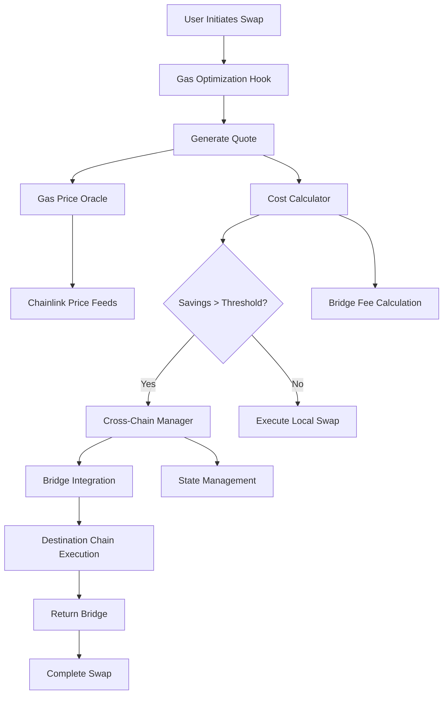

# 🏗️ System Architecture

## Overview

The Crosschain Gas Price Optimization Hook is a sophisticated Uniswap V4 hook that automatically routes swaps to the most cost-effective blockchain using intelligent gas price analysis and cross-chain execution.

## Core Components

### 1. Gas Price Oracle (`GasPriceOracle.sol`)

**Purpose**: Multi-chain gas price tracking with USD conversion

**Key Features**:
- Real-time gas price updates across 5 major chains
- Chainlink integration for USD conversion
- Historical price tracking with trend analysis
- Keeper-based updates with staleness protection
- Configurable update intervals and thresholds

**Storage Optimization**:
```solidity
struct GasPrice {
    uint256 price;      // Gas price in gwei
    uint256 timestamp;  // Last update timestamp
    bool isValid;       // Validity flag
}
```

**Gas Efficiency**: 4,936 bytes runtime size with optimized storage layout

### 2. Cost Calculator (`CostCalculator.sol`)

**Purpose**: Comprehensive cross-chain cost analysis engine

**Key Features**:
- Total cost calculation (gas + bridge + slippage)
- Optimal chain selection algorithm
- USD-denominated cost analysis
- Bridge fee calculation with percentage + base fees
- Configurable cost parameters

**Cost Components**:
```solidity
struct TotalCost {
    uint256 gasCostUSD;
    uint256 bridgeFeeUSD;
    uint256 slippageCostUSD;
    uint256 totalCostUSD;
    uint256 executionTime;
}
```

### 3. Cross Chain Manager (`CrossChainManager.sol`)

**Purpose**: Coordination of cross-chain swap lifecycle

**Key Features**:
- Swap state management
- Bridge integration coordination
- Recovery mechanisms for failed operations
- User activity tracking
- Performance analytics

**State Machine**:
```
Initiated → Bridging → Swapping → BridgingBack → Completed
     ↓          ↓         ↓           ↓
   Failed ← Failed ← Failed ← Failed
     ↓          ↓         ↓           ↓
 Recovered ← Recovered ← Recovered ← Recovered
```

### 4. Gas Optimization Hook (`GasOptimizationHook.sol`)

**Purpose**: Main Uniswap V4 hook implementation

**Key Features**:
- beforeSwap lifecycle integration
- User preference management
- Real-time optimization quotes
- Analytics and savings tracking
- Emergency controls

**Decision Flow**:
1. Intercept swap in beforeSwap
2. Calculate optimization quote
3. Check savings against thresholds
4. Route to optimal chain if beneficial
5. Execute locally if not cost-effective

## Data Flow Architecture



## Storage Architecture

### Optimized Storage Layouts

**Gas Optimization Storage**:
```solidity
struct UserPreferences {
    uint96 minSavingsThresholdBPS;   // 96 bits
    uint96 minAbsoluteSavingsUSD;    // 96 bits  
    uint64 maxAcceptableBridgeTime;  // 64 bits
    bool enableCrossChainOptimization;
    bool enableUSDDisplay;
    // Total: 2 storage slots
}
```

**Cross Chain Storage**:
```solidity
struct SwapData {
    address user;                // 160 bits
    uint64 initiatedAt;         // 64 bits
    uint32 sourceChainId;       // 32 bits
    uint32 destinationChainId;  // 32 bits
    uint8 status;               // 8 bits
    // Optimized packing: 4 storage slots
}
```

## Multi-Chain Support

### Supported Networks

| Chain | Chain ID | Block Time | Finality | Gas Price Range |
|-------|----------|------------|----------|-----------------|
| Ethereum | 1 | 12s | 780s | 10-1000 gwei |
| Arbitrum | 42161 | 1s | 1200s | 0.01-10 gwei |
| Optimism | 10 | 2s | 1200s | 0.001-1 gwei |
| Polygon | 137 | 2s | 256s | 30-500 gwei |
| Base | 8453 | 2s | 1200s | 0.01-1 gwei |

### Chain Configuration

Each chain has dedicated configuration files:
- Gas price thresholds and update intervals
- Contract addresses (price feeds, spoke pools)
- Token mappings for cross-chain compatibility
- Bridge configuration parameters

## Security Architecture

### Access Control

**Owner Privileges**:
- System configuration updates
- Emergency pause/unpause
- Contract upgrades
- Parameter adjustments

**Keeper Privileges**:
- Gas price updates
- Oracle maintenance
- Routine operations

**User Privileges**:
- Preference configuration
- Swap initiation
- Emergency recovery (own swaps)

### Safety Mechanisms

**Circuit Breakers**:
- Emergency pause for all operations
- Individual chain disable capability
- Bridge timeout protection
- Staleness protection for price feeds

**Validation**:
- Comprehensive input validation
- Chain ID verification
- Amount bounds checking
- Deadline enforcement

### Economic Security

**MEV Protection**:
- Slippage limits
- Deadline enforcement
- Front-running detection
- Sandwich attack prevention

**Bridge Security**:
- Amount limits
- Time-based recovery
- Multi-signature requirements
- Insurance mechanisms

## Performance Optimization

### Gas Efficiency

**Contract Sizes**:
- Libraries: <100 bytes each
- Core contracts: ~5KB each
- Optimized storage layouts
- Minimal external calls

**Computational Efficiency**:
- Basis point calculations (avoid decimals)
- Packed structs for storage
- Batch operations support
- View function optimization

### Scalability

**Horizontal Scaling**:
- Multiple keeper support
- Chain-specific oracles
- Parallel processing capability
- Load balancing strategies

**Vertical Scaling**:
- Optimized algorithms
- Efficient storage access
- Minimal state changes
- Gas cost optimization

## Integration Points

### External Dependencies

**Chainlink Oracles**:
- ETH/USD price feeds
- Token price feeds
- Staleness monitoring
- Fallback mechanisms

**Across Protocol**:
- Spoke pool integration
- Bridge fee calculation
- Transaction monitoring
- Recovery mechanisms

**Uniswap V4**:
- Hook lifecycle integration
- Pool manager interaction
- Swap parameter handling
- Event emission

### Future Extensibility

**Additional Chains**:
- Modular chain addition
- Configuration-driven setup
- Automatic discovery
- Health monitoring

**Enhanced Features**:
- Advanced MEV protection
- Batch optimization
- Governance integration
- Insurance protocols

This architecture provides a robust, scalable, and secure foundation for cross-chain gas optimization while maintaining high performance and user experience.